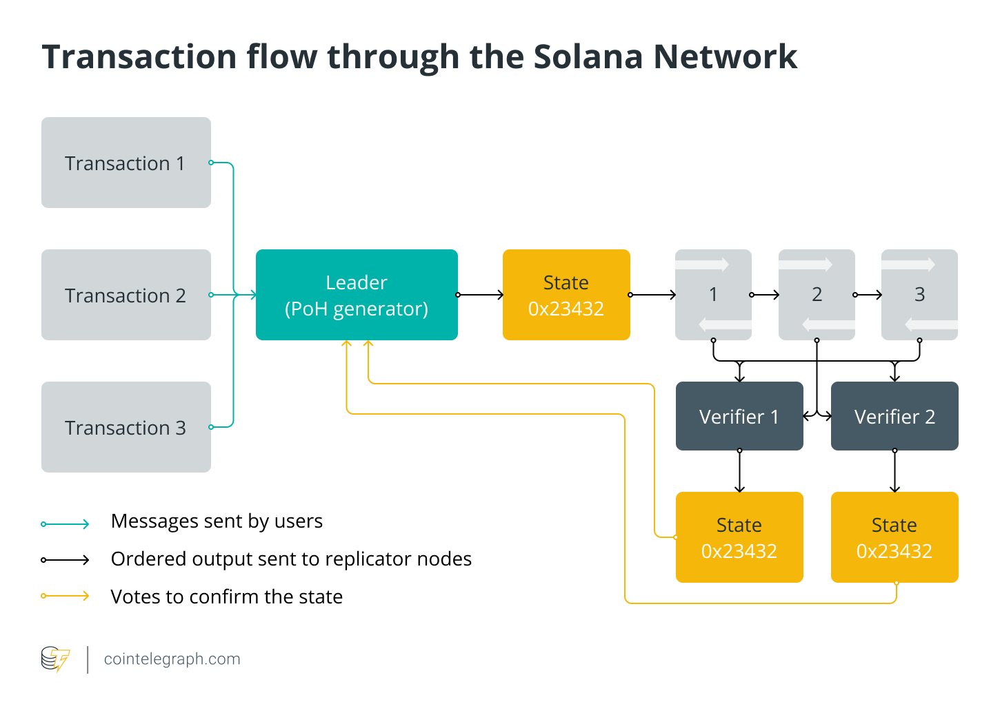
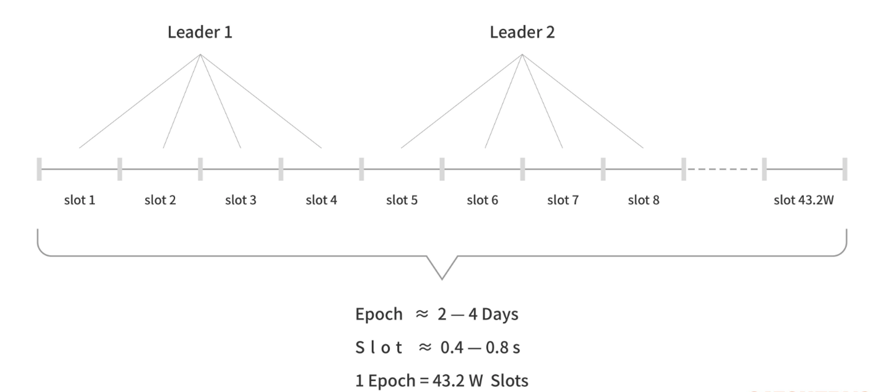

# Content/ 引文

先来了解下在 Solana的系统架构中最重要的两种角色：**Leader**（出块者）和 **Validator**（验证者）。两者实际上都是质押了 SOL 代币的全节点，只是在不同的出块周期内，Leader 会由不同的全节点来充当，而没有当选 Leader 的全节点会成为 Validator。 所以在选择验证者方面， Solana 采用的是 `PoS`（权益证明）机制，验证者是通过抵押一定数量的代币来参与网络交易的验证的，持有更多代币的验证者有更大的机会被选中生成新的区块。

1. 用户发起交易后，会被客户端直接转发给 Leader 节点，或者先被普通节点接收，再立刻转发给 Leader；
2. 出块者 Leader 接收网络内全部的待处理交易，一边执行，一边给交易指令排序，制成交易序列（类似区块）。每隔一段时间，Leader 会把排好的交易序列发送给 Validator 验证节点；
3. Validator 按照交易序列（区块）给定的顺序执行交易，产生相应的状态信息State（执行交易会改变节点的状态，比如改变某些账户的余额）；
4. 每发送 N 个交易序列，Leader 会定期公开本地的状态 State，Validator会将其与自己的 State 作对比，给出 肯定/否定 的投票。这一步就类似于以太坊2.0或其他POS公链里的“检查点”。
5. 如果在规定时间内，Leader收集到占全网 2/3质押权重的节点们给出的肯定票，则此前发布的交易序列和状态 State 就被敲定，“检查点”通过，相当于区块完成最终确认 Finality；
6. 一般而言，给出肯定票的 Validator 节点与出块者 Leader 所执行的交易、执行后的状态都是相同的，数据会同步。

### Solana 如何通过 PoS 指定 Leader ？

在 Solana 的共识协议中，有 Epoch（纪元）和Slot（间隔）两大时间单位。每个 Slot 约为0.4~0.8秒，相当于一个区块的时间间隔。而每个Epoch周期包含43.2万个Slot（区块），长达2~4天。每过4个 Slot（出块周期），Leader节点就会进行一次变更。

在每个新的Epoch周期开始时，Solana网络会按照各节点的质押权重进行抽选，组成一个出块者Leader轮换名单，“钦定”了未来不同时刻的出块者。也就是说出块者会提前获知他们成为出块者。 具体而言，究竟如何指定 Leader 会考虑诸多因素，比如：

1. **质押的代币数量：** 在PoS中，质押的代币数量是一个关键的考虑因素。Validator 通常倾向于选择质押数量较大的节点，因为这增加了节点被选中为区块生产者的机会。这也有助于确保网络由具有足够利益参与的节点维护。
2. **节点的性能：** Validator 的节点性能是另一个关键因素。高性能的节点能够更快速地验证和打包交易，有助于维持网络的高吞吐量。Validator 可能会选择性能较好的节点以提高整个网络的效率。
3. **网络延迟：** Validator 可能会考虑节点之间的网络延迟。选择网络延迟较低的节点有助于减少区块的传播时间，从而提高网络的实时性。
4. **节点的可用性：** Validator 会关注节点的可用性，确保它们能够稳定运行而不容易出现故障。可靠的节点能够为网络提供更稳定的服务。

Solana 要实现的目标是选择一组合适的 Leader，确保网络的安全性、效率和公平性。通过综合考虑这些因素，Solana 能够做出最佳的区块生产决策，从而推动网络的正常运行。

### 回顾

现在在了解了基础的细节后，让我们来看看 Solana 的网络整体是如何通过 PoH 和 PoS 运作的：

1. **生成交易：** 用户创建并广播交易，包含交易的详细信息和数字签名。
2. **PoH 链上的排序：** 交易的哈希通过数字签名连接到 PoH 链上。由于PoH 链是有序的，交易也就被排序了。
3. **Validator** **验证：** Validator 负责验证交易的有效性，并选择哪些交易将包含在下一个区块中。Validator 的选择可能基于质押的代币数量、验证者的性能等因素。
4. **交易打包成区块：** Validator 选择的交易被打包成一个区块，其中包括一个特殊的块生产交易，它包含了当前 PoH 链的哈希以及其他信息。
5. **区块传播和确认：** 区块广播到整个网络，其他节点验证并确认区块的有效性。确认后，区块和其中包含的交易就被添加到整个区块链中。

通过这个过程，Solana 通过 PoH 链的时间有序性和 PoS 的节点验证机制，实现了交易的流转和整个区块链的更新。这样的设计使得 Solana 平均出块时间被压缩至 400 毫秒，且无需 Layer2 即拥有较高速度，手续费亦可忽略不计。
