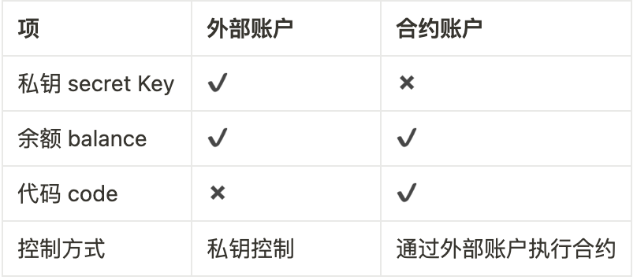

# Content/ 引文

在了解完历史证明的概念之后之后让我们一起来学习 Solana 中最重要的概念之一 ：账户。账户之所以这么重要，是因为 Solana 作为一个分布式区块链系统，所有的信息都存储在账户中，如智能合约（Solana 叫 Onchain Program）、状态信息、Token数据、配置信息等都是存储在一个个账户中。

在学习 Solana 账户之前，让我们首先回顾一下以太坊的账户类型

以太坊将账户划分为两类：**外部账户（EOA）**和**合约账户（Contract Account）**。

### 外部账户

EOA-外部账户(external owned account)是由人们通过私钥创建的账户。 是真实世界的金融账户的映射，拥有该账户私钥的任何人都可以控制该账户。 如同银行卡，到ATM机取款时只需要密码输入正确即可交易。 这也是人类与以太坊账本沟通的唯一媒介，因为以太坊中的交易需要签名， 而只能使用拥有私有外部账户签名。大家通过 Metamask 创建的账户就属于外部账户。

外部账户特点总结：

1. 拥有以太币余额。
2. 能发送交易，包括转账和执行合约代码。
3. 被私钥控制。
4. 没有相关的可执行代码。

### 合约账户

含有合约代码的账户。 被外部账户或者合约创建，合约在创建时被自动分配到一个账户地址， 用于存储合约代码以及合约部署或执行过程中产生的存储数据。 合约账户地址是通过SHA3哈希算法产生，而非私钥。 因无私钥，因此无人可以拿合约账户当做外部账户使用。 只能通过外部账户来驱动合约执行合约代码。

让我们来理解一下外部账户和合约账户的异同

### Solana 账户

在以太坊中，我们将代码与数据、状态直接存储在智能合约中。而 Solana 账户最大的不同就是将两者分开存放在不同的账户上。所以 Solana 账户又分为**程序账户**和**数据账户**。（*说明：Solana中的智能合约并不叫“智能合约”，而是“程序program”，尽管它们代表的是相似的概念。为了避免混淆，后续我们将统一使用“程序”这一术语。*）

- **程序账户（可执行账户）**：存储不可变的数据，主要用于存储程序的代码（BPF 字节码）。
- **数据账户（不可执行账户）**：存储可变的数据，主要用于存储程序的状态。

Solana 链上程序是只读或无状态的，即程序的账户（可执行账户）只存储代码，不存储任何状态，程序会把状态存储在其他独立的账户（不可执行账户）中。如果一个程序账户是一个数据账户的所有者，那么它就可以改变数据账户中的状态。