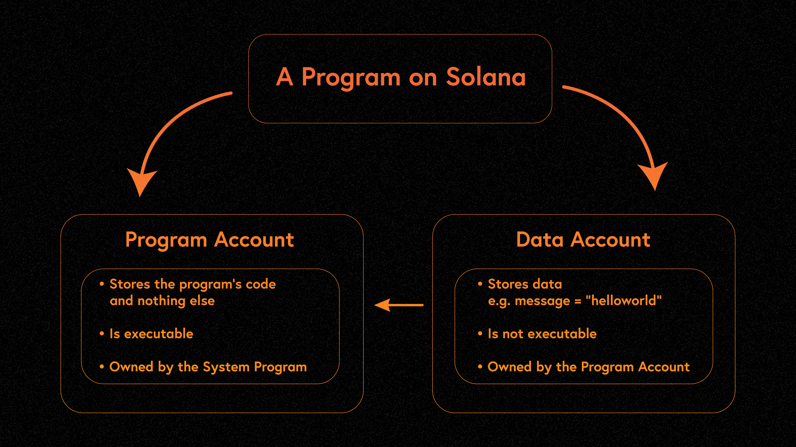

# Content/ 引文

本节我们继续学习 Solana 中的程序 program。

### 什么是程序

Solana 程序，在其他链上叫做智能合约，是所有链上活动的基础。任何开发者都可以在 Solana 链上编写以及部署程序。 链上的一切活动，从去中心化金融（DeFi），到非同质化代币（NFT），再到社交媒体，链上游戏，都由Solana程序所驱动。

### Solana 的**程序有哪几种**

通常可以分为以下两种：

**On-chain Programs：**这些是部署在 Solana 上的用户编写的程序，由开发者在 Solana 网络上根据具体业务场景开发的程序。它们可以通过升级权限进行升级，该权限通常是部署程序的帐户或者指定的其他账户。

**Native programs：**这些是集成到 Solana 核心模块中的程序。它们提供了验证节点（validator）运行所需的基本功能。native programs 只能通过网络范围内的软件更新进行升级。常见的原生程序有 [System Program](https://docs.solana.com/developing/runtime-facilities/programs#system-program)、[BPF Loader Program](https://docs.solana.com/developing/runtime-facilities/programs#bpf-loader) 、[Vote program](https://docs.solana.com/developing/runtime-facilities/programs#vote-program) 和 [Solana Program Libraries - SPL](https://spl.solana.com/)等。其中 [System Program](https://docs.solana.com/developing/runtime-facilities/programs#system-program) 这个程序负责管理建立新账户以及在两个账户之间转账SOL。[Solana SPL](https://spl.solana.com/) 程序定义了一系列的链上活动，其中包括针对代币的创建，交换，借贷，以及创建质押池，维护链上域名解析服务等。

### Solana 的**程序有特点？**

Solana 程序模型的显着特征之一是**代码和数据的分离**。程序存储在程序账户中，它是无状态的，这意味着它们不会在内部存储任何状态，但它是可执行的`executable`，会执行相应的逻辑。相反，它们需要操作的所有数据都存储在单独的数据帐户中，这些帐户在 Transaction 交易中通过引用传递给程序账户，因为它本身是不可执行的。



Solana中将程序和状态分离的设计，这是很多以太坊开发者来到Solana生态最大的困惑，但这样的设计确实带来了很大的好处：

程序可以独立于状态进行开发、测试、部署和升级，提高了程序的可重用性和可扩展性。相反在以太坊中，智能合约和状态是绑定到一起的，合约的升级是一件非常麻烦的事情，必须通过代理模式间接实现逻辑和状态的分离，才可以进行逻辑的升级，并且在新的智能合约中，新增变量的处理要非常小心，避免存储布局 Layout 冲突，覆盖掉旧变量。

此外，由于状态数据是以账户的形式存储在网络中，因此可以方便地进行分片和并行处理，从而提高了 Solana 网络的吞吐量和效率。

所以，Solana中的程序和状态分离的设计提高了程序的可重用性和可扩展性，同时也提高了Solana网络的吞吐量和效率，使得网络的升级和维护变得更加容易。

### **如何编写程序**

这里我们看一个简单的 solana 程序，这是 Rust 编写的 hello world 程序，实现了简单的日志打印。通常我们将程序写在`lib.rs`文件中：

```jsx
// 引入 Solana 程序的相关依赖
use solana_program::{
    account_info::AccountInfo,
    entrypoint,
    entrypoint::ProgramResult,
    pubkey::Pubkey,
    msg
};

// 程序入口点
entrypoint!(process_instruction);

// 指令处理逻辑
pub fn process_instruction(
    program_id: &Pubkey,
    accounts: &[AccountInfo],
    instruction_data: &[u8]
) -> ProgramResult{
    msg!("Hello, world!");

    Ok(())
}
```

所有的程序都有一个单独的入口点，类似于 Rust 中的`main`函数，指令的执行就是从这里开始的（即`process_instruction`），参数须包括：

- program_id: pubkey （程序ID，即程序地址）
- accounts: AccountInfo数组，指令所涉及的账户集合。
- instruction_data: byte array字节数组，即指令所需的参数，该例子中并没有用到。

在实际的项目中，通常不会把所有逻辑都写在`lib.rs`文件中，为了更清晰的划分功能模块，大部分程序遵循以下架构：


最近，[Anchor](https://project-serum.github.io/anchor/getting-started/introduction.html) 逐渐成为了一个广受欢迎的Solana程序开发框架，它通过减少样板代码并简化序列化和反序列化来简化程序的创建。在后续的章节，我们也会有专门的介绍。