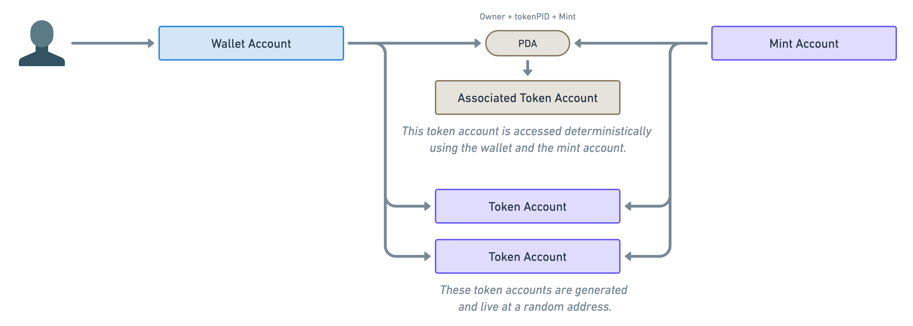

# Content/**Metadata Account**

上节课我们已经学习了关于 Solana 上 NFT 的简单概念，它就是一个供应量固定为 1 的 SPL Token，这节课我们要继续学习，如何把 NFT 的其他附加数据，比如创建者、名称和图片地址等等，添加到 Token 中。

**Metaplex**

> 相较于以太坊上部署的智能合约，它们包含该合约所需的逻辑代码和数据，而 Solana 并非如此，在 Solana 中，**程序**（相当于智能合约）与存储在程序外部的**数据帐户**进行交互，这样数据就不再受程序大小的限制，我们就能够实现很多更具扩展性的功能。
> 

基于此，**Metaplex** 组织推出了一系列工具和程序，以便于 Solana NFT 的创建、发布和交易，让您轻松管理包括创建和铸造 NFT 集合的整个流程。

> **Metaplex** 协议主要包含了三个程序，分别是 **Token Metadata**、**The Candy Machine** 、**Auction House** 

1. Token Metadata 用来定义NFT元数据的标准；
2. The Candy Machine 负责NFT的分发
3. Auction House 负责NFT拍卖和销售。
> 

本课程主要用到的是 **Token Metadata** 程序，作用是将附加数据添加到 SPL Token 中，该元数据包含了代币创建者的许多信息，包括创建者、名称、交易税、URL、升级管理等信息。

**Metadata Account**

关于 SPL Token，假如我们现在想要向其他人发送一些 Kitty 代币，但其他人目前没有任何关于 Kitty 代币的账户，那该怎么办？难到我们要为他们创建一个新的 Kitty 代币帐户，然后才能向他们发送 Kitty 代币吗？

通过前面对 Solana 基础课程的学习，我们知道解决方案就是 **PDA** （程序派生地址），它使用特殊算法从其他公钥派生出新的公钥。这样，给定一个“**钱包账户**”和一个“**铸币账户**”，我们就可以确定地找到关联的代币账户，这些账户被称为 **ATA** （关联令牌账户）。

**Metaplex** 协议中的 **Metadata Account** 同样是在这个基础之上做了扩展，定义了用来存储 NFT 元数据信息的 Account，我们叫做 "**Metadata Account**"，其地址是经由**Metadata NFT** 管理程序和 SPL Token 的 **Mint Account**，推导出来的 PDA 唯一地址。

因此，我们知道了 SPL Token ，也就可以知道其对应的 Metadata。

理解了这个概念，我们知道如何为 NFT 添加名称（Name）、符号（Symbol）和创作者（Creators）等等附加信息。

学习到这里，我们知道了如何为我们的 NFT 添加元数据，但这还不够，我们还要管理 NFT 的发行量，**Metaplex** 引入 ****Master Edition Account 来管理 NFT 的增发。

请跟着我们继续学习！🚀🚀🚀
