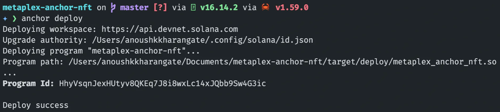

# Content/Module

这是一节交互的内容！在这里你不会学习枯燥的代码，相反你需要回顾一下我们前几章学习的内容，我们会带你运行程序铸造自己的 NFT。

1. **准备工作**
    
    使用**Solana CLI** 将网络设置为 **devnet**
    
    ```bash
    solana config set --url devnet
    ```
    
    确认网络是否设置生效
    
    ```bash
    Config File: /Users/anoushkkharangate/.config/solana/cli/config.yml
    RPC URL: https://api.devnet.solana.com
    WebSocket URL: wss://api.devnet.solana.com/ (computed)
    Keypair Path: /Users/anoushkkharangate/.config/solana/id.json
    Commitment: confirmed
    ```
    
2. **使用 Anchor CLI 来创建项目**
    
    ```rust
    anchor init metaplex_nft
    ```
    
3. **确认项目的网络设置**
    
    在您的项目中，找到`Anchor.toml` 文件，其中 `provider` 的网络是否设置为 **devnet**
    
    ```toml
    [features]
    seeds = false
    [programs.devnet]
    metaplex_nft = "Fg6PaFpoGXkYsidMpWTK6W2BeZ7FEfcYkg476zPFsLnS"
    
    [registry]
    url = "https://anchor.projectserum.com"
    
    [provider]
    cluster = "devnet"
    wallet = "/Users/<user-name>/.config/solana/id.json"
    
    [scripts]
    test = "yarn run ts-mocha -p ./tsconfig.json -t 1000000 tests/**/*.ts"
    ```
    
4. **项目导入依赖项**
    
    在您的项目中，找到 **programs** 的文件夹，转到 `programs/metaplex_nft/Cargo.toml` 并添加这些依赖项。
    
    ```toml
    [dependencies]
    anchor-lang = "0.24.2"
    anchor-spl = "0.24.2"
    mpl-token-metadata = { version = "1.2.5", features = ["no-entrypoint"] }
    ```
    
5. **导入项目代码**
    
    在您的项目中，找到 **programs** 的文件夹，转到 `programs/metaplex_nft/src/lib.rs` ，并导入我们前面学习的项目代码：
    
    ```rust
    use anchor_lang::prelude::*;
    use anchor_lang::solana_program::program::invoke;
    use anchor_spl::token;
    use anchor_spl::token::{MintTo, Token};
    use mpl_token_metadata::instruction::{create_master_edition_v3, create_metadata_accounts_v2};
    
    declare_id!("3bfaUxYjL8PhJbCiw9rxjaijdgyUs8cJNGSufPuaPuKu");
    
    #[program]
    pub mod metaplex_nft {
        use super::*;
    
        pub fn mint_nft(
            ctx: Context<MintNFT>,
            creator_key: Pubkey,
            uri: String,
            title: String,
        ) -> Result<()> {
            msg!("Initializing Mint Ticket");
            let cpi_accounts = MintTo {
                mint: ctx.accounts.mint.to_account_info(),
                to: ctx.accounts.token_account.to_account_info(),
                authority: ctx.accounts.payer.to_account_info(),
            };
            msg!("CPI Accounts Assigned");
            let cpi_program = ctx.accounts.token_program.to_account_info();
            msg!("CPI Program Assigned");
            let cpi_ctx = CpiContext::new(cpi_program, cpi_accounts);
            msg!("CPI Context Assigned");
            token::mint_to(cpi_ctx, 1)?;
            msg!("Token Minted !!!");
            let account_info = vec![
                ctx.accounts.metadata.to_account_info(),
                ctx.accounts.mint.to_account_info(),
                ctx.accounts.mint_authority.to_account_info(),
                ctx.accounts.payer.to_account_info(),
                ctx.accounts.token_metadata_program.to_account_info(),
                ctx.accounts.token_program.to_account_info(),
                ctx.accounts.system_program.to_account_info(),
                ctx.accounts.rent.to_account_info(),
            ];
            msg!("Account Info Assigned");
            let creator = vec![
                mpl_token_metadata::state::Creator {
                    address: creator_key,
                    verified: false,
                    share: 100,
                },
                mpl_token_metadata::state::Creator {
                    address: ctx.accounts.mint_authority.key(),
                    verified: false,
                    share: 0,
                },
            ];
            msg!("Creator Assigned");
            let symbol = std::string::ToString::to_string("symb");
            invoke(
                &create_metadata_accounts_v2(
                    ctx.accounts.token_metadata_program.key(),
                    ctx.accounts.metadata.key(),
                    ctx.accounts.mint.key(),
                    ctx.accounts.mint_authority.key(),
                    ctx.accounts.payer.key(),
                    ctx.accounts.payer.key(),
                    title,
                    symbol,
                    uri,
                    Some(creator),
                    1,
                    true,
                    false,
                    None,
                    None,
                ),
                account_info.as_slice(),
            )?;
            msg!("Metadata Account Created !!!");
            let master_edition_infos = vec![
                ctx.accounts.master_edition.to_account_info(),
                ctx.accounts.mint.to_account_info(),
                ctx.accounts.mint_authority.to_account_info(),
                ctx.accounts.payer.to_account_info(),
                ctx.accounts.metadata.to_account_info(),
                ctx.accounts.token_metadata_program.to_account_info(),
                ctx.accounts.token_program.to_account_info(),
                ctx.accounts.system_program.to_account_info(),
                ctx.accounts.rent.to_account_info(),
            ];
            msg!("Master Edition Account Infos Assigned");
            invoke(
                &create_master_edition_v3(
                    ctx.accounts.token_metadata_program.key(),
                    ctx.accounts.master_edition.key(),
                    ctx.accounts.mint.key(),
                    ctx.accounts.payer.key(),
                    ctx.accounts.mint_authority.key(),
                    ctx.accounts.metadata.key(),
                    ctx.accounts.payer.key(),
                    Some(0),
                ),
                master_edition_infos.as_slice(),
            )?;
            msg!("Master Edition Nft Minted !!!");
    
            Ok(())
        }
    }
    
    #[derive(Accounts)]
    pub struct MintNFT<'info> {
        #[account(mut)]
        pub mint_authority: Signer<'info>,
    
        /// CHECK: This is not dangerous because we don't read or write from this account
        #[account(mut)]
        pub mint: UncheckedAccount<'info>,
        // #[account(mut)]
        pub token_program: Program<'info, Token>,
        /// CHECK: This is not dangerous because we don't read or write from this account
        #[account(mut)]
        pub metadata: UncheckedAccount<'info>,
        /// CHECK: This is not dangerous because we don't read or write from this account
        #[account(mut)]
        pub token_account: UncheckedAccount<'info>,
        /// CHECK: This is not dangerous because we don't read or write from this account
        pub token_metadata_program: UncheckedAccount<'info>,
        /// CHECK: This is not dangerous because we don't read or write from this account
        #[account(mut)]
        pub payer: AccountInfo<'info>,
        pub system_program: Program<'info, System>,
        /// CHECK: This is not dangerous because we don't read or write from this account
        pub rent: AccountInfo<'info>,
        /// CHECK: This is not dangerous because we don't read or write from this account
        #[account(mut)]
        pub master_edition: UncheckedAccount<'info>,
    }
    ```
    
6. **构建并部署程序**
    
    运行 `anchor build && anchor deploy` ，您应该会看到已部署的 **Program ID**
    
    
    
    将 **Program ID** 粘贴到 `Anchor.toml` 和 `lib.rs` 文件中的临时 ID。
    
    至此，我们的 NFT 程序已经部署完成，下面开始我们的交互环节。
    
7. **导入调用 Solana 程序并铸造 NFT 的代码**
    
    在您的项目中，找到 **tests** 的文件夹，转到 `tests/metaplex_nft.ts` 并粘贴下面的代码：
    
    ```tsx
    import * as anchor from '@project-serum/anchor'
    import { Program, Wallet } from '@project-serum/anchor'
    import { MetaplexAnchorNft } from '../target/types/metaplex_nft'
    import { TOKEN_PROGRAM_ID, createAssociatedTokenAccountInstruction, getAssociatedTokenAddress, createInitializeMintInstruction, MINT_SIZE } from '@solana/spl-token' // IGNORE THESE ERRORS IF ANY
    const { SystemProgram } = anchor.web3
    
    describe('metaplex_nft', () => {
      // Configure the client to use the local cluster.
      const provider = anchor.AnchorProvider.env();
      const wallet = provider.wallet as Wallet;
      anchor.setProvider(provider);
      const program = anchor.workspace.MetaplexAnchorNft as Program<MetaplexAnchorNft>
    
      it("Is initialized!", async () => {
        // Add your test here.
    
        const TOKEN_METADATA_PROGRAM_ID = new anchor.web3.PublicKey(
          "metaqbxxUerdq28cj1RbAWkYQm3ybzjb6a8bt518x1s"
        );
        const lamports: number =
          await program.provider.connection.getMinimumBalanceForRentExemption(
            MINT_SIZE
          );
        const getMetadata = async (
          mint: anchor.web3.PublicKey
        ): Promise<anchor.web3.PublicKey> => {
          return (
            await anchor.web3.PublicKey.findProgramAddress(
              [
                Buffer.from("metadata"),
                TOKEN_METADATA_PROGRAM_ID.toBuffer(),
                mint.toBuffer(),
              ],
              TOKEN_METADATA_PROGRAM_ID
            )
          )[0];
        };
    
        const getMasterEdition = async (
          mint: anchor.web3.PublicKey
        ): Promise<anchor.web3.PublicKey> => {
          return (
            await anchor.web3.PublicKey.findProgramAddress(
              [
                Buffer.from("metadata"),
                TOKEN_METADATA_PROGRAM_ID.toBuffer(),
                mint.toBuffer(),
                Buffer.from("edition"),
              ],
              TOKEN_METADATA_PROGRAM_ID
            )
          )[0];
        };
    
        const mintKey: anchor.web3.Keypair = anchor.web3.Keypair.generate();
        const NftTokenAccount = await getAssociatedTokenAddress(
          mintKey.publicKey,
          wallet.publicKey
        );
        console.log("NFT Account: ", NftTokenAccount.toBase58());
    
        const mint_tx = new anchor.web3.Transaction().add(
          anchor.web3.SystemProgram.createAccount({
            fromPubkey: wallet.publicKey,
            newAccountPubkey: mintKey.publicKey,
            space: MINT_SIZE,
            programId: TOKEN_PROGRAM_ID,
            lamports,
          }),
          createInitializeMintInstruction(
            mintKey.publicKey,
            0,
            wallet.publicKey,
            wallet.publicKey
          ),
          createAssociatedTokenAccountInstruction(
            wallet.publicKey,
            NftTokenAccount,
            wallet.publicKey,
            mintKey.publicKey
          )
        );
    
        const res = await program.provider.sendAndConfirm(mint_tx, [mintKey]);
        console.log(
          await program.provider.connection.getParsedAccountInfo(mintKey.publicKey)
        );
    
        console.log("Account: ", res);
        console.log("Mint key: ", mintKey.publicKey.toString());
        console.log("User: ", wallet.publicKey.toString());
    
        const metadataAddress = await getMetadata(mintKey.publicKey);
        const masterEdition = await getMasterEdition(mintKey.publicKey);
    
        console.log("Metadata address: ", metadataAddress.toBase58());
        console.log("MasterEdition: ", masterEdition.toBase58());
    
        const tx = await program.methods.mintNft(
          mintKey.publicKey,
          "https://arweave.net/y5e5DJsiwH0s_ayfMwYk-SnrZtVZzHLQDSTZ5dNRUHA",
          "NFT Title",
        )
          .accounts({
            mintAuthority: wallet.publicKey,
            mint: mintKey.publicKey,
            tokenAccount: NftTokenAccount,
            tokenProgram: TOKEN_PROGRAM_ID,
            metadata: metadataAddress,
            tokenMetadataProgram: TOKEN_METADATA_PROGRAM_ID,
            payer: wallet.publicKey,
            systemProgram: SystemProgram.programId,
            rent: anchor.web3.SYSVAR_RENT_PUBKEY,
            masterEdition: masterEdition,
          },
          )
          .rpc();
        console.log("Your transaction signature", tx);
      });
    });
    ```
    
8. 现在只需运行 `anchor test`，你应该能够铸造你的 NFT
    
    运行成功会输出：
    
    ```bash
    Account:  4swRFMNovHCkXY3gDgAGBXZwpfFuVyxWpWsgXqbYvoZG1M63nZHxyPRm7KTqAjSdTpHn2ivyPr6jQfxeLsB6a1nX
    Mint key:  DehGx61vZPYNaMWm9KYdP91UYXXLu1XKoc2CCu3NZFNb
    User:  7CtWnYdTNBb3P9eViqSZKUekjcKnMcaasSMC7NbTVKuE
    Metadata address:  7ut8YMzGqZAXvRDro8jLKkPnUccdeQxsfzNv1hjzc3Bo
    MasterEdition:  Au76v2ZDnWSLj23TCu9NRVEYWrbVUq6DAGNnCuALaN6o
    Your transaction signature KwEst87H3dZ5GwQ5CDL1JtiRKwcXJKNzyvQShaTLiGxz4HQGsDA7EW6rrhqwbJ2TqQFRWzZFvhfBU1CpyYH7WhH
        ✔ Is initialized! (6950ms)
    
      1 passing (7s)
    
    ✨  Done in 9.22s.
    ```
    
9. **您可以在这里查看 NFT**
    
    用前面铸造完成输出的 `Mint key` 替换掉下面链接的 **Token**，打开链接即可查看：
    
    [https://solscan.io/token/DehGx61vZPYNaMWm9KYdP91UYXXLu1XKoc2CCu3NZFNb?cluster=devnet](https://solscan.io/token/DehGx61vZPYNaMWm9KYdP91UYXXLu1XKoc2CCu3NZFNb?cluster=devnet)
    

恭喜你🎉，完成本课程！