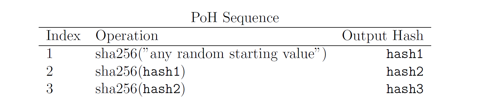

# Content

### **Previous Section Recap**

In the previous section, we gained a preliminary understanding of the Solana blockchain. In this section, we continue our exploration of Solana's consensus mechanism.

Just like in the Bitcoin genesis block, Satoshi Nakamoto left the front-page headline article of The Times that day - The Times 03/Jan/2009 Chancellor on brink of second bailout for banks. This proves that the genesis block was minted by miners on or after January 3, 2009. All subsequent Bitcoin transactions also occur after this time node.

If all transactions (or events) are sequential and timestamped, it forms a historical event sequence based on time. To verify a transaction's occurrence in this sequence, we can simply refer to this historical sequence.

### **Hash Functions**

Solana's ***Proof of History*** (PoH) consensus mechanism utilizes the SHA-256 hash function, a secure hash algorithm that transforms arbitrary-length input (message) into a fixed-length output. Its role is crucial for ensuring the chronological order and security of the network. Important properties of hash functions include:

1. Different inputs should map to unique hash values, and it should be computationally infeasible to derive the original input from the hash value. A good hash function should be one-way to prevent reverse calculation.
2.  Minor changes in input data should result in significant changes in the output hash value. Similar but different inputs should produce entirely different hash values to enhance security and reduce the likelihood of collisions. 
3. The same input should always produce the same hash value to ensure repeatability and consistency.

### **Workflow of PoH**

Let's look at a simplified PoH workflow. It starts with a random value, runs the hash function, and uses the output as the input for the next iteration. The number of function executions and the results of each call are recorded. This count provides support for both order and time dimensions, while concatenating outputs forms a complete chain of evidence.

The choice of a random value could be the headline of "The Times" on that day or other facts.

hashN represents the actual hash output. In Solana, each transaction is connected to the hash of the previous transaction, forming a chain of transactions. When a certain number of transactions are executed and constitute a PoH chain, they are bundled into a block (slot).

As long as the chosen hash function is collision-resistant, this hash set can only be sequentially computed by a single thread. This satisfies the condition that when the index is 300, obtaining such results without actually running the algorithm 300 times is infeasible.

Thus, we can infer the actual past time from index 0 to index 300 from the data structure. In this way, even though each node's timestamp in the network may be inconsistent, we have a globally consistent clock in the network through the number of hash iterations (e.g., 300), serving as a substitute for time and maintaining the order of transactions.

### **Verifiability of PoH**

Due to the verifiable and ordered nature of the PoH flow, additional data such as hash count and event information are included during hash calculations. Therefore, regardless of how quickly or how much data is recorded in the PoH-based data structure, we can determine the order of hashes (blocks) by specifying the number of iterations and event information.

### **Broadcasting in PoH**

When a new block is generated, we can slice the block's data and structure and parallelize the verification on multiple GPU cores. After verification, it will be broadcasted on the Solana network. Due to the chronological order of blocks and consistent time clocks in each node, we can easily verify the validity of blocks and determine their order.
