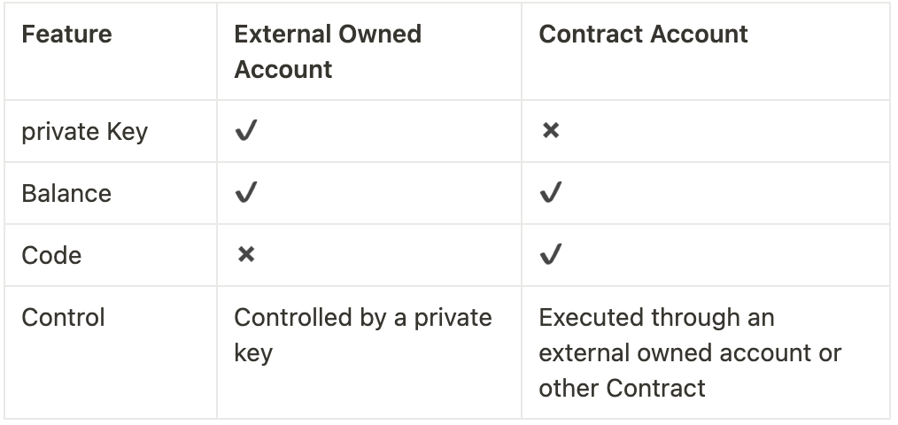

# Content

In Solana, one of the most crucial concepts is that of ***accounts***. Accounts play a pivotal role because, as a distributed blockchain system, all information is stored within these accounts. This includes smart contracts (referred to as Onchain Programs in Solana), state information, token data, configuration details, and more.

Before delving into Solana accounts, let's briefly review the account types in Ethereum.

### **Ethereum Account Types**

Ethereum classifies accounts into two types: ***External Owned Account (EOA)*** and ***Contract Account***.

### External Owned Account (EOA)

EOA, or external owned account, are accounts created by individuals through private keys. These accounts mirror real-world financial accounts, and anyone with the private key has control over the account. Similar to a bank card, transactions in Ethereum require a correct password input when withdrawing from an ATM. This is the sole means of communication between humans and the Ethereum ledger because transactions in Ethereum need to be signed, and only an EOA with a private key can sign. Accounts created through MetaMask are examples of external owned account.

Key features of external owned account:

1. Own Ethereum balance.
2. Can send transactions, including transfers and execution of contract code.
3. Controlled by a private key.
4. Do not have associated executable code.

### Contract Account

Contract account contain contract code. They are created by external owned account or other contracts. Contracts, when created, are automatically assigned to an account address used for storing contract code and any storage data generated during contract deployment or execution. The address of a contract account is generated through the SHA3 hashing algorithm and not a private key. As it lacks a private key, a contract account cannot be used as an external owned account. Contract execution and code invocation are only possible through an external owned account.

Let's understand the similarities and differences between external owned account and contract account:

### Solana Account

In Ethereum, code and data/state are stored directly in smart contracts. Solana, on the other hand, distinguishes between executable and non-executable accounts, leading to the concepts of ***Program Account and Data Account***.

- **Program Account (Executable Account):** Stores immutable data, primarily used for storing program code (BPF bytecode).
- **Data Account (Non-Executable Account):** Stores mutable data, mainly used for storing the program's state.

In Solana, on-chain programs are read-only or stateless. This means that program account (executable account) only store code and no state. The program stores its state in other independent accounts (non-executable account). If a program account owns a data account, it can modify the state within that data account.

