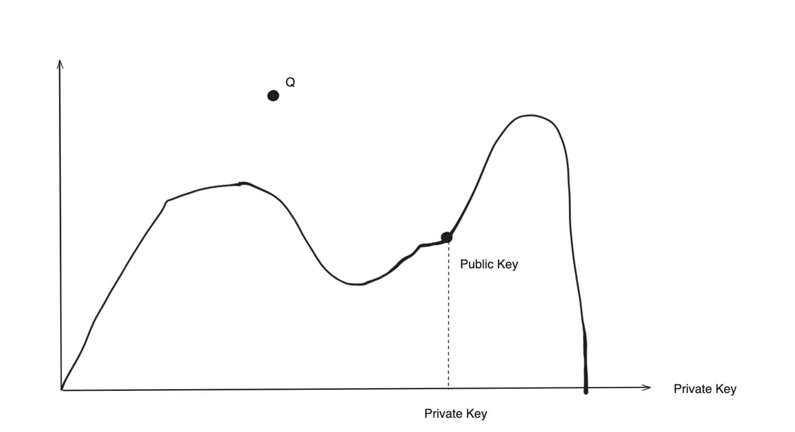

# Content

### **What is PDA?**

In the Solana blockchain, PDA stands for "Program Derived Address." It's a special type of address generated by Solana programs, not directly derived from a user's private key. ***The main purpose of PDA is to allow programs to own and control certain data or assets without the need for traditional private key signatures***.

If you find this concept confusing, let's break it down for a more detailed explanation.

### **Private Key, Public Key, and Mnemonic**

Similar to Ethereum, Solana has three main components: private key, public key, and mnemonic. The private key is kept private and should not be disclosed. When authorizing a transaction, we sign it with our private key to grant authorization. The private key, a random string of characters, corresponds to a mnemonic phrase. The mnemonic phrase can be used to derive the private key through an algorithm. Therefore, while using a wallet, it's sufficient to remember the mnemonic phrase. The public key can be derived from the private key using encryption algorithms. The public key is shareable, and others can use it to transfer funds to you. Additionally, the public key serves as the address for a program, known as **`program_id`**.

It's important to note that we can derive the private key from the mnemonic phrase and derive the public key from the private key, but we cannot reverse-engineer the private key or mnemonic from the public key. This ensures the security of encrypted addresses. This process involves the **`ECDSA`** algorithm, and for a deeper understanding, you may explore the principles of the **`ECDSA`** algorithm.



As shown in the simplified diagram above, each X-axis private key corresponds to a Y-axis public key on the curve. However, the Q point's public key has no corresponding private key on any X-axis. This means that this public key has no corresponding private key! This implies that this public key is not derived from any private key.

This is the principle of PDA. A "Program Derived Address" (PDA) has no corresponding private key. It is derived from a program's **`program_id`** and **`seed`**, which is why it's called a "Program Derived Address." Sometimes, the public key obtained through the **`program_id`** and seed has a corresponding private key. In such cases, we need to regenerate a public key, typically by adding a number outside our **`program_id`** and seed (this number has a special term called **`bump`**). This number starts from 255 and decreases until we generate a public key with no corresponding private key.

### **Why Do We Need PDA?**

In blockchain, you need a private key to prove ownership of a public key. You can sign and authorize transfer requests for the account using this private key. However, if the account is owned by a decentralized program instead of an individual, placing the private key on chain is not a good idea. Since all program code is public on the chain, if everyone can see your private key, malicious operations, such as stealing your tokens, can occur. This is where a PDA without a private key comes in handy. In this way, the program can sign an address without needing a private key.

### **How to Generate a PDA Address**

Here, we use the Solana **`Anchor`** development framework to initialize a PDA account (we will provide a dedicated introduction to the Anchor framework in later sections; here, we aim to give you a basic understanding of the PDA account generation process).

```rust
// Data stored in the PDA account
pub struct Counter {
    count: u64

```

This PDA account stores data of the **`Counter`** structure, which includes a **`u64`** type value **`count`**.

```rust
pub struct InitializeAccounts<'info> {
		#[account(
			init,
			seeds = [b"my_seed",
							 user.key.to_bytes().as_ref()
							]
			bump,
			payer = user,
			space = 8 + 8
		)]
		pub pda_counter: Account<'info, Counter>,
}

```

The **`pda_counter`** field represents the PDA account to be generated. We marked the **`seeds`** values and **`bump`** used during initialization. The seeds can be any byte array set according to the business scenario. Anchor automatically uses the first bump value that meets the conditions, so there's no need for manual specification. Internally, Anchor also automatically retrieves the **`program_id`**, so no manual specification is required here either.

However, we need to specify the **`space`** occupied by the account and the account used to pay the initialization transaction fee (**`payer`**). Here, the account's space size is specified as 16 bytes. The first 8 bytes store the discriminator added automatically by Anchor to identify the account type. The next 8 bytes allocate space for the data stored in the **`Counter`** account type (**`count`** is of type u64, occupying 8 bytes). The space is mainly used to calculate the account's rent in the network.

While this code snippet is not complete, it demonstrates the related content of PDA accounts: **`program_id`** Program ID, seed, bump value, and space. Detailed explanations will follow in later sections.
