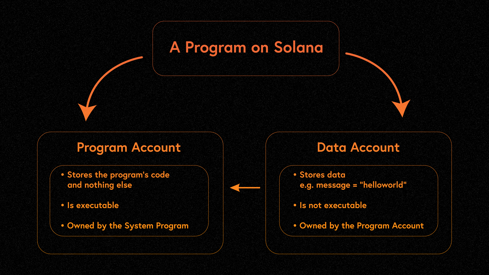

# Content

### **What is a Program in Solana?**

In Solana, programs, known as smart contracts on other chains, form the foundation of all on-chain activities. Any developer can write and deploy programs on the Solana network. Everything on the chain, from decentralized finance (DeFi) and non-fungible tokens (NFTs) to social media, blockchain games, is driven by Solana programs.

### **Types of Programs in Solana**

Generally, Solana programs can be categorized into two types:

**On-chain Programs:** These are user-written programs deployed on Solana, developed by developers for specific business scenarios on the Solana network. They can be upgraded with upgrade permissions, typically held by the account that deployed the program or other specified accounts.

**Native Programs:** These are programs integrated into the core modules of Solana. They provide essential functionalities required for validator nodes to run. Native programs can only be upgraded through software updates within the network. Common native programs include the [System Program](https://docs.solana.com/developing/runtime-facilities/programs#system-program), [BPF Loader Program](https://docs.solana.com/developing/runtime-facilities/programs#bpf-loader), [Vote program](https://docs.solana.com/developing/runtime-facilities/programs#vote-program), and [Solana Program Libraries - SPL](https://spl.solana.com/). The [System Program](https://docs.solana.com/developing/runtime-facilities/programs#system-program) is responsible for managing the creation of new accounts and transferring SOL between two accounts. [Solana SPL](https://spl.solana.com/) programs define a series of on-chain activities, including token creation, exchange, lending, creating staking pools, maintaining on-chain domain name resolution services, and more.

### F**eatures of Solana Programs**

One significant feature of the Solana program model is the **separation of code and data**. Programs are stored in program accounts, which are stateless, meaning they don't internally store any state. However, they are executable (**`executable`**) and perform the corresponding logic. Instead, all the data they need to operate is stored in separate data accounts, which are passed as references to the program account in transactions.



The design of separating programs and states in Solana is one of the biggest sources of confusion for many Ethereum developers who enter the Solana ecosystem. However, this design brings significant benefits:

- Programs can be developed, tested, deployed, and upgraded independently of the state, enhancing the reusability and scalability of programs. In contrast, in Ethereum, smart contracts and states are tightly bound together, and upgrading a contract is a challenging task that usually requires an indirect approach through proxy patterns to achieve logic and state separation. Care must be taken in Ethereum to avoid storage layout conflicts and overwriting old variables when adding new variables in the new smart contract.
- Since state data is stored as accounts on the network, it can be conveniently sharded and processed in parallel, leading to increased throughput and efficiency in the Solana network.

The separation of programs and states in Solana's design improves program reusability and scalability and enhances the network's throughput and efficiency, making upgrades and maintenance easier.

### **How to Write a Program**

Let's take a look at a simple Solana program, a hello-world program written in Rust that logs a simple message. Usually, the program is written in the **`lib.rs`** file:

```rust
// Importing dependencies for Solana programs
use solana_program::{
    account_info::AccountInfo,
    entrypoint,
    entrypoint::ProgramResult,
    pubkey::Pubkey,
    msg
};

// Program entry point
entrypoint!(process_instruction);

// Instruction processing logic
pub fn process_instruction(
    program_id: &Pubkey,
    accounts: &[AccountInfo],
    instruction_data: &[u8]
) -> ProgramResult{
    msg!("Hello, world!");

    Ok(())
}
```

Every program has a single entry point, similar to the **`main`** function in Rust, where instruction execution begins (**`process_instruction`**). The parameters must include:

- **`program_id`**: pubkey (Program ID, the address of the program)
- **`accounts`**: an array of **`AccountInfo`**, representing the collection of accounts involved in the instruction.
- **`instruction_data`**: a byte array, representing the parameters required for the instruction. In this example, it's not used.

In actual projects, most programs follow a modular architecture for clearer functionality division. The typical structure includes:


Recently, [Anchor](https://project-serum.github.io/anchor/getting-started/introduction.html) has become a widely popular Solana program development framework. It simplifies program creation by reducing boilerplate code and simplifying serialization and deserialization. In upcoming sections, we will provide a dedicated introduction to Anchor.