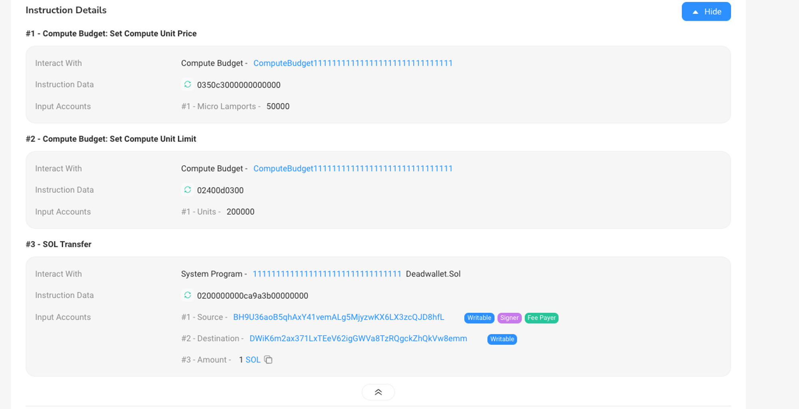

# Content

### **Transaction**

A transaction is a set of atomic operations representing a series of changes to the blockchain state, including transferring tokens, invoking programs, and updating account status. Each transaction has a unique signature and is composed of one or more instructions. Transaction fees are typically paid using Solana's native token, SOL.

**Signature:** Each transaction must be signed by the private key of one or more accounts to ensure the identity and integrity of the transaction.

### **Instruction**

An instruction within a transaction is a specific command that contains all the necessary data for its execution. It may include the program's unique identifier (program_id), a list of accounts, instruction parameters, configuration information, etc., required to perform a specific operation.

A transaction composed of multiple instructions can achieve various operations, forming an atomic transaction.

When initiating a transfer or calling a program through Solana, we use a transaction. Each transaction includes:

- `instructions`: One or more instructions.
- `blockhash`: The latest block hash value.
- `signatures`: Signatures of the initiator corresponding to the instructions.

Our interaction with Solana occurs through transactions, with the smallest unit of interaction being the instruction within a transaction (`Instruction`). A transaction can package multiple instructions, specifying which program to call, which accounts to read or modify, and providing any additional data required for program execution.

After completing a transfer transaction, we can review related operations on the blockchain explorer. A typical transfer transaction might include three instructions: **Compute Budget: Set Compute Unit Price**, **Compute Budget: Set Compute Unit Limit**, and **Sol Transfer**.

- Set Compute Unit Price: Set the price of a single CU.
- Set Compute Unit Limit: Set the maximum number of CUs that can be consumed.
- Transfer: Execute a token transfer.

