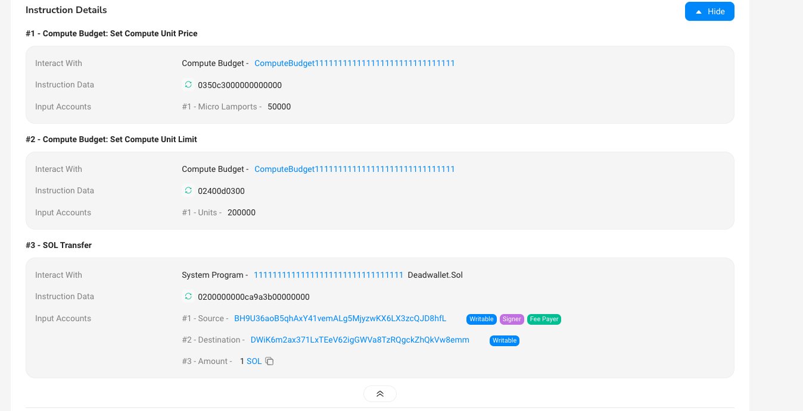
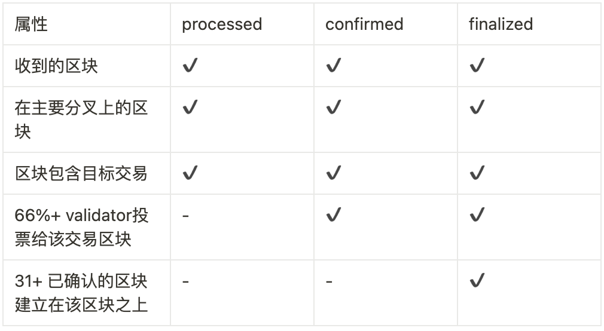

# Content

### Transaction Fees

In the previous chapter, we discussed what transactions and instructions are, and executing a transaction requires **Compute units (CU)**.

If you're familiar with the ***Ethereum Virtual Machine (EVM)***, **CU (Compute Unit)** is analogous to gas fees.

However, if you're not familiar, think of Solana as a public giant computer composed of multiple interconnected nodes. Node operators often invest significant physical resources (such as CPU, GPU) to maintain the stable operation of this giant computer. To reward node operators for processing a large number of transactions and maintaining network stability, gas fees serve as compensation for their contributions.

The existence of CUs serves other purposes as well, such as:

1. Introducing actual costs for transactions to reduce network spam.
2. Setting a minimum fee for each transaction to provide long-term economic stability to the network.

Therefore, when a user sends a transaction on the chain, they usually need to pay a fee to process the instructions included in the transaction.

- The following operations generate **Compute units**:
    - Executing SBF instructions
    - Passing data between programs
    - Invoking system calls
    - Logging
    - Creating program addresses
    - Cross-program invocation

### CU Maximum Limit

Due to variations in the number of instruction calls and data volume in each transaction, each transaction is set with a **maximum CU limit** — the "compute budget" — to ensure that the data volume of a single transaction does not become too large, causing network congestion.

Each instruction's execution consumes a different number of CUs. After consuming a significant number of CUs (i.e., exceeding the maximum CU specified by the "compute budget"), instruction execution will stop and return an error, resulting in transaction failure.

### Transaction Fee

In a transfer transaction, you can observe the settings for **CU limit** and **CU price**.

In the `Set Compute Unit Price` instruction, you can see that the `compute budget` program sets the price per CU to `50000` lamports (**1 SOL = 1000,000,000 lamports**).

In the `Set Compute Unit Limit` instruction, the `compute budget` program sets the CU consumption limit for this transaction to **200,000.** If the total CU consumption of all instructions in a transaction exceeds 200,000, the transaction will fail.

> The fee calculation formula is: Number of CUs * CU Price = Transaction Fee
> 



### Transaction Confirmation

A transaction can be categorized into the following main states based on its confirmation level on the Solana network:

```jsx
'processed': The latest block confirmed once by querying connected nodes.
'confirmed': The latest block confirmed once by querying the cluster.
'finalized': The latest block completed by the cluster.
```



| Attribute | processed | confirmed | finalized |
| --- | --- | --- | --- |
| Blocks received | ✔ | ✔ | ✔ |
| Blocks on the main fork | ✔ | ✔ | ✔ |
| Blocks containing the target transaction | ✔ | ✔ | ✔ |
| 66%+ stake voted for the block | - | ✔ | ✔ |
| 31+ confirmed blocks built on top of this block | - | - | ✔ |
