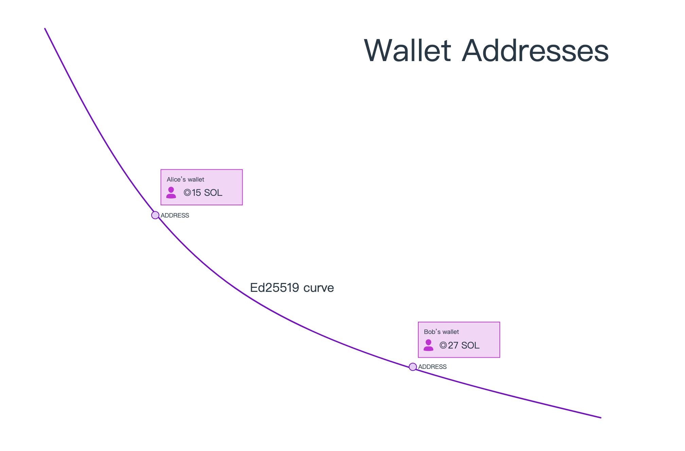
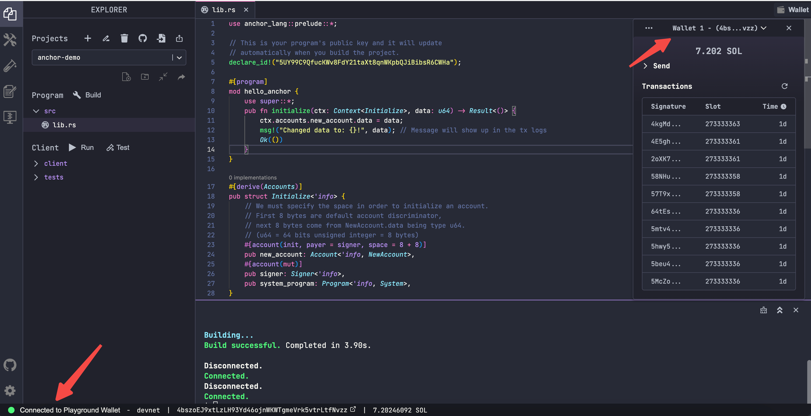

# Content

### What is a Keypair?

In Solana, the `Ed25519 curve` asymmetric encryption algorithm is employed to generate digital signatures and verify them. Unlike symmetric encryption algorithms, asymmetric encryption uses a pair of keys: a public key (`pubkey`) and a private key (`secretkey`). If the public key is used for encryption, only the corresponding private key can decrypt it. If the private key is used for encryption, the corresponding public key can be used to verify the signature, determining if it was initiated by the owner of the private key.

In Solana, public keys serve as the `address` pointing to an account on the network. Due to the low readability of addresses, domain systems can be used, such as using `example.sol` to point to an address like `dDCQNnDmNbFVi8cQhKAgXhyhXeJ625tvwsunRyRc7c8`, making the address more identifiable.

Private keys are used to authenticate the permissions of the key pair. If you possess the private key for a certain address, you have control over the tokens within that address. It is crucial to keep the private key confidential. The recommended practice is to use a wallet.

### What is a Wallet?

A wallet is a secure place to store private keys. It can be simply categorized into software wallets and hardware wallets. The former can be an app or a browser wallet plugin (more convenient for interacting with websites), allowing us to easily view wallet addresses, submit transactions, and sign with private keys. The latter stores private keys on a separate hardware device. Compared to software wallets, hardware wallets are usually more secure as they are offline and less susceptible to network attacks. However, their usage is not as convenient and flexible as software wallets. The choice between them depends on specific circumstances.

### Testing Wallet in the Playground

Solana's `[***Playground***](https://beta.solpg.io/)` is an online IDE tool for experiencing and testing Solana blockchain functionality in the browser, similar to Ethereum's `Remix` development tool. We will use Solana Playground extensively in the upcoming lessons.

In the Playground, wallets are usually generated through Solana's default mechanism, including a public key and a private key. This key pair can be used to perform various operations in the Playground, such as creating accounts and sending transactions. Users can manage the generated wallets through the interface.

For the development environment, you can claim test `SOL` from this [***faucet***](https://faucet.solana.com/). It allows claiming up to 10 every hour (we will need a significant amount of test coins in the upcoming lessons).

Note that Solana Playground is a testing and learning tool, and the generated wallets are mainly for simulating interactions on the Solana blockchain. They are not suitable for real production environments. In real applications, more secure and professional methods are required for wallet generation and management.

### Phantom Software Wallet

When dealing with actual asset management, it is advisable to use a professional software wallet or hardware wallet.

For example, [***Phantom***](https://phantom.app/) is one of the most widely used software wallets in the Solana ecosystem. It supports popular browsers and has a mobile application for connecting anytime, anywhere. For more information, you can visit its official website.

