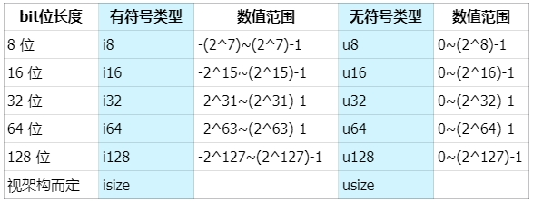

# Content

In Rust, the most commonly used numeric types in basic data types are **signed integers** (`i8`, `i16`, `i32`, `i64`, `isize`), **unsigned integers** (`u8`, `u16`, `u32`, `u64`, `usize`), and **floating-point numbers** (`f32`, `f64`).

**Integers** are numbers without a fractional part and come in several types:



The representation format is **i/u + type size (bits)**. The `i` stands for the first letter of the English word ***integer***, representing signed types that include negative integers, zero, and positive integers. Conversely, `u` stands for ***unsigned*** ***integer*** types, representing only zero and positive integers. The default integer type in Rust is `i32`, using 32 bits to represent signed integers.

**Floating-point numbers** are numbers with a decimal point. In Rust, there are two basic types for floating-point numbers: `f32` and `f64`, representing sizes of 32 and 64 bits, respectively. The default floating-point type is `f64`.

- **Metaphor**
    
    Many programming languages categorize numeric types into various kinds (like i8, i16, i32...). This is done to save memory and optimize performance. It's akin to deciding where to put an apple—you can choose to hold it in your hand, place it in a plate, or even put it in a backpack. However, using a large pot for a single apple might be a bit of an overkill. 😂
    
- **Real-world Example**
    
    In Solana, when calling on-chain programs (smart contracts), the parameters passed are arrays of type `u8`. The native token `sol` is represented as `u64`.
    
    ```rust
    pub fn process_instruction(
        program_id: &Pubkey,
        accounts: &[AccountInfo],
        // Parameters received by the program (smart contract)
        instruction_data: &[u8]
    ) -> ProgramResult {}
    
    // solana_program::native_token::LAMPORTS_PER_SOL
    pub const LAMPORTS_PER_SOL: u64 = 1_000_000_000;
    ```
    

### Documentation

Let's now explore how numeric values are defined and represented.

```rust
// Here, 'a' is of the default i32 type
let a = 1;
// You can also specify it as a specific integer type
let b: u32 = 1;

// Here, 'c' is of the default f64 type
let c = 1.0;
// You can also specify it as a specific floating-point type
let d: f32 = 1.0;

// Rust allows convenient representation of numbers in different bases, choose the one that suits you
let x: i32 = 100_000_000;
let y: i32 = 0xffab;
let z: i32 = 0o77;
let m: i32 = 0b1111_0000;
let n: u8 = b'A';
println!("x = {}, y = {}, z = {}, m = {}, n = {}", x, y, z, m, n);
```

### FAQ

- **Q1: What do `isize` and `usize` represent?**
    
    A: The `isize` and `usize` types depend on the CPU type the program is running on. If the CPU is 32-bit, these types are 32-bit; if the CPU is 64-bit, then they are 64-bit.
    

# Example

Rust supports basic mathematical operations for all numeric types: addition, subtraction, multiplication, division, and modulo, but the variables being calculated must be of ***the same data type.***

```solidity
fn main() {
    // default type i32
    let sum = 1 + 2;

    // default type f64
    let difference = 1.1 - 2.2;

    // default type i32
    let mul = 2 * 50;

    // default type f64
    let div = 1.1 / 2.2;

    // default type i32
    let remainder = 11 % 5;

    println!("sum: {}, difference: {}, mul: {}, div: {}, remainder: {}", sum, difference, mul, div, remainder);

    // The compiler will automatically deduce the type of ferris i32
    let ferris = 10;
    // You can also explicitly declare the data type through type annotation
    let ferris_one: i32 = 10;
    // Type annotation through type suffix: 10 is i32 type
    let ferris_two = 10i32;

    // Only operations of the same type can be performed
    let addition = ferris + ferris_one + ferris_two;
    println!("{} + {} + {} = {}",ferris, ferris_one, ferris_two, addition);

    // Define an f32 array, in which 12.0 will automatically be deduced as the f32 type
    let arr = [1.0, 1.1f32, 1.2_f32];
    // Print the first value arr[0] in the array, and use {:.2} to control the decimal place to 2 digits
    println!("{:.2}", arr[0]);
}

// Next, let’s take a look at Rust’s handling strategies when encountering integer calculation overflow.

fn main() {
    // u32-bit unsigned integer maximum value
    let a: u32 = 4_294_967_295;
    let b: u32 = 1;
    // output result 
    println!("Original: {}", a);
    println!("Add 1: {}", b);

    // Using wrapping_* methods is handled according to the two's complement loop overflow rules in all modes, if a value exceeds the maximum value, it restarts counting from 0.
    let result_wrapping = a.wrapping_add(b);
    // result_wrapping  0
    println!("Wrapping Result: {}", result_wrapping);

    // saturating_* returns the maximum value of the corresponding type when the integer overflows, and returns the minimum value if it underflows.
    let result_saturating = a.saturating_add(b);
    // result_saturating 4294967295
    println!("Saturating Result: {}", result_saturating);

    // The return value of checked_* is Option, which is None when it overflows, otherwise it is Some(result). You can check whether the operation caused an overflow.
    let result_checked = a.checked_add(b);
    // return None
    match result_checked {
        Some(result) => println!("Checked Result: {}", result),
        None => println!("Checked Result: Overflow!"),
    }

    // overflowing_* The return value is (result, overflowed), the result value and a Boolean value indicating whether there is overflow
    let (result_overflowing, overflowed) = a.overflowing_add(b);
    // return (0, true)
    if overflowed {
        println!("Overflowing Result: Overflow!");
    } else {
        println!("Overflowing Result: {}", result_overflowing);
    }
    
}
```