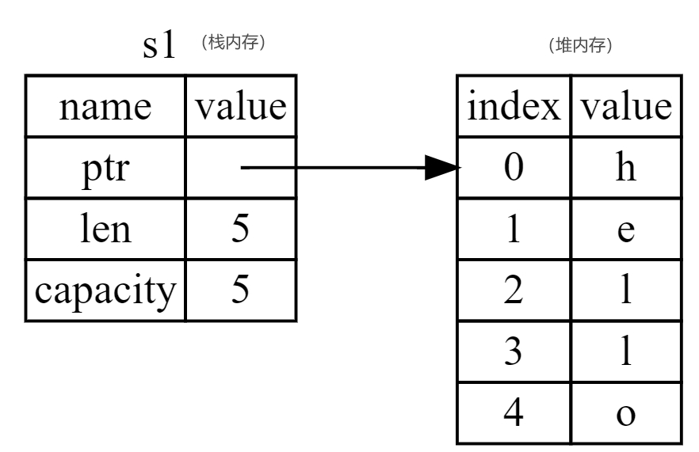
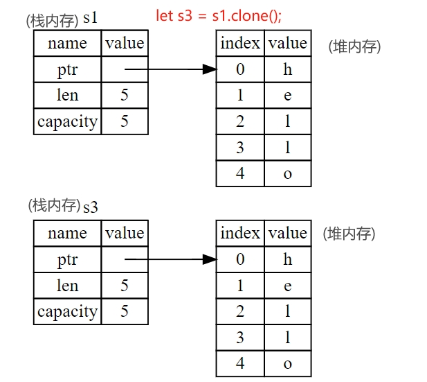

# Content

> In the previous sections, we introduced Rust's basic types such as `i32`, `char`, `f64`, `bool`, etc. These types are of known size and are stored in the **stack memory**. In the upcoming sections on Rust's **ownership** feature, we will delve into knowledge related to **heap memory**. For now, let's use `String` as an example and focus on the aspects of `String` related to ownership, exploring how Rust manages data in both stack and heap memory. A more in-depth explanation of the `String` type will be covered in the third chapter.
> 

Let's begin by introducing two fundamental concepts about memory: stack memory and heap memory. It's important to note that these concepts are not exclusive to Rust.

**Stack Memory:** It primarily stores data of fixed size basic data types, and the allocation and deallocation are very fast. It stores values in the order they are placed and retrieves values in the reverse order. This is also known as **Last In, First Out (LIFO)**.

**Heap Memory:** It stores data structures whose size dynamically changes at runtime, allowing more flexible data sharing and dynamic allocation. When putting data into the heap, the memory allocator finds a large enough space, marks it as used, and returns a **pointer** representing the address of that location. In summary, there is no inherent superiority or inferiority between heap and stack memory; they are simply suited for different scenarios.

**Dynamic String(String type):** These are collections of `char` with a variable size. This type allows programs to dynamically manage string data on the heap at runtime, such as allocating, growing, and modifying string content. This capability enables the storage of content with unknown sizes at compile time.

- **Metaphor**
    
    Stack memory usage is akin to stacking plates: when adding more plates, they are placed on top of the existing stack, and when a plate is needed, it is taken from the top. No additions or removals can be made from the middle or bottom of the stack. The size of the data stored in stack memory, like plates, is fixed, making allocation and deallocation fast. On the other hand, heap memory usage is comparable to placing goods in a warehouse. Before storing, a sufficient area must be cleared, and after retrieval, this area is released. The size of the goods has no fixed requirement; as long as the warehouse can accommodate them, it's acceptable.
    
- **Use Case**
    
    Memory is one of the precious storage resources in computers, and for blockchains, storage is equally important. To prevent misuse of on-chain resources, Solana introduces the `rent` mechanism, requiring each account to pay rent for the on-chain space it occupies. Rent is determined based on the size of the occupied space and time. However, if the account balance is greater than the total rent for two years, Solana no longer charges rent. In this context, rent more resembles a concept of a deposit.
    

### Documentation:

Let's see the creation of a dynamic string through the following code:

```rust
use std::io;

fn main() {
    // Create a mutable string variable to store user input
    let mut input: String = String::new();
    println!("Please enter your name:");
    // Read user input and store it in the input variable
    io::stdin()
        .read_line(&mut input)
        .expect("Failed to read input");
    // Print the user-input string
    println!("Your name is: {}", input);
}

```

### FAQ:

- **Q: What is the structure of dynamic strings in memory in Rust, and how does memory change when copying occurs? (Please refer to the Example.)**
    
    A: **Creating** a dynamic string `hello` involves the memory allocator allocating a blank region in the **heap memory**, currently 5 bytes in size, to store the value of `hello`. When this dynamic string is assigned to the variable `s1`, `s1` will store information about this string in heap memory on the **stack**. This information includes a pointer to heap memory, the string's length, and the allocated heap memory capacity. The structure in memory looks like this:
    
    
    
    **Clone:** Suppose we want to modify this string without affecting other places where this string is used. What should we do? The answer is: clone it, i.e., generate a copy of this string, modify the copy, and achieve the desired result. After cloning, the structure in memory looks like this:
    
    
    
    However, cloning can have an impact on performance, especially for frequently executed code paths or when cloning large memory objects. In other programming languages (such as Java), there is also a **shallow copy**, which only copies data from the **stack memory**. This operation is highly efficient, but since both variables point to the same heap memory, both variables can modify the data, leading to data races. Thus, caution is required.
    
    Fortunately, Rust has its own mechanisms: **ownership and borrowing**, which we will cover in the following sections.
    

# Example

The code below shows the creation of dynamic strings and the code for cloning. So what is its structure in memory? See FAQ.

```rust
fn main() {
     let s1 = String::from("hello");
    
     // Clone, copy the data of variable s1 in the heap memory, and store it in the newly opened memory space
     //Variable s3 records the position, length, and size information of the new space in the stack memory.
     let s3 = s1.clone();
     println!("s1 = {}, s3 = {}", s1, s3);
}
```