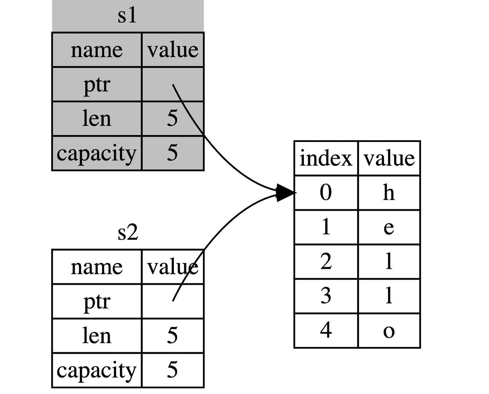

# Content

In this section, we will learn about one of Rust's important features: **ownership**. Ownership allows Rust to ensure memory safety without the need for a garbage collector. Therefore, understanding how ownership works in Rust is crucial.

**Ownership:** In Rust, every value has a unique owner (e.g., in the code from the previous section `let s1 = String::from("hello");`, the variable `s1` is the owner of the value `hello`). The owner is responsible for managing the allocation and deallocation of memory resources for that value. Rust uses ownership rules to dictate how memory management should occur, ensuring that the program does not encounter issues like data races or dangling pointers.

**Three Ownership Principles:**

1. Each value in Rust has a variable that is its owner.
2. A value can have only one owner at a time.
3. When the owner (variable) goes out of scope, the value will be **dropped**.
- **Metaphor**
    
    The concept of ownership in Rust closely resembles the legal concept of ownership, such as property deeds, vehicle registrations, stocks, etc. These legal documents signify ownership of certain things, and the owner is responsible for managing these items. Similarly, in Rust, the owner is responsible for managing the memory of a value—allocating, using, and eventually releasing it. Just as in legal ownership, when a property changes hands, the previous owner loses all rights and responsibilities, and the new owner takes over. In Rust, when a value is transferred (or "moved") to another variable, the original owner relinquishes control, ensuring that ***at any given moment, each value has only one clearly defined owner***.
    
- **Use Case**
    
    In real-world projects, it is common to follow the pattern of passing references instead of direct ownership transfer, as direct ownership transfer might lead to unpredictable consequences. Therefore, in the Solana project, we often see the use of references with the `&` symbol.
    
    ```rust
    // Here we are still passing a reference of instruction_data to the internal function
    pub fn unpack(instruction_data: &[u8]) -> Result<Self, ProgramError> {}
    ```
    

### Documentation:

In the following code, we demonstrate ownership with **allocation** and **modification**.

```rust
// Variable s1 owns the string "hello"
let mut s1: String = String::from("hello");

// The variable s1 can modify this string
s1.push_str(", hackquest."); // push_str() appends a literal to the string
```

### FAQ:

- **Q1: What is the scope of variables in Rust?**
    
    A: The effective range of a variable starts from its declaration and lasts until the end of the current scope. In Rust, when a variable leaves its scope, not only does the variable become invalid, but its memory (if it occupies memory) is also **dropped**.
    
    ```rust
    fn main() {
        {                     // s1 is invalid here; it has not been declared yet
            let s1 = String::from("hello");  // s1 is valid from here
        }                     // Leaving the scope, s1 becomes invalid, and the memory it occupies is dropped
    
        {
            let s2 = "hello"; // s2 is valid from here
            // do something using s2
        }                     // This scope has ended, s2 is no longer valid, and no memory needs to be dropped
    }
    ```
    
- **Q2: What happens in memory when ownership is transferred (moved) in Rust?** (Refer to the code on the right in the Example.)
    
    A: The string `hello` is in the heap memory. The variable `s1` owns the value. When `s1` transfers ownership to `s2`, `s2` copies the information from `s1`, creating a new record in the stack memory with the string's pointer, length, and capacity information. This operation is known as **"shallow copy"**, meaning only references are copied, not the data (as explained in the previous section). According to the second principle of ownership in Rust: **a value can have only one owner at a time**, at this point, `s1` becomes invalid, and `s2` now owns the string.
    
    In summary, ownership transfer (move) involves two parts: **shallow copy** + **old variable loses ownership** (which is easily overlooked).
    
    
    

# Example

Next, let's learn how ownership move is implemented at the code level. For changes in the underlying memory, please refer to Q2 in the FAQ on the left.

```solidity
//Move ownership
fn main() {
     let s1 = String::from("hello");
    
     //Here s1 moved ownership to variable s2. According to the second of the three principles of ownership,
// At this time, only s2 has ownership, which means that s1 has expired.
     let s2 = s1;
    
     // Printing s1 here will fail because it is invalid
     // println!("{}, world!", s1);

} //The third principle of ownership is triggered here, that is, drop the s2 variable and release the memory
```