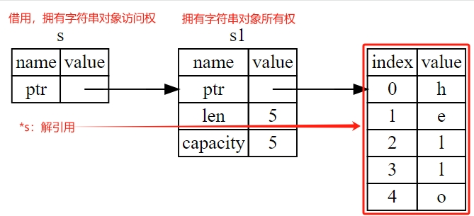

# Content

> In the previous section, we introduced ownership and ownership transfer. However, relying solely on transferring ownership to acquire a value can make the program complex. Therefore, let's explore another feature in Rust: **Borrowing**.
> 

**Borrowing:** It refers to gaining **access** to data through references without taking ownership. Borrowing is denoted by the `&` symbol. It allows multiple parts of the program to access the same data without transferring ownership. Borrowing in Rust comes in two forms: **mutable borrowing** and **immutable borrowing**.

**Dereferencing:** This is a crucial operation in borrowing, allowing the retrieval of the actual content of the borrowed value. In simple terms, it is about getting the value of the borrowed object. It is denoted by the `*` symbol.

- **Metaphor**
    
    In the context of ownership, "borrowing" is easy to understand. Imagine you own a car; in this case, you have ownership of the car. If you lend the car to a friend,they have to return it after using, this is "borrowing” Meanwhile, if your friend shows off the car to others on the street, that's "dereferencing" in Rust terminology.
    
- **Use Case**
    
    In the entry function of a Solana program, the parameters are all borrowed (referenced) types.
    
    ```rust
    entrypoint!(process_instruction);
    
    pub fn process_instruction(
      program_id: &Pubkey,
      accounts: &[AccountInfo],
      instruction_data: &[u8]
    ) -> ProgramResult {}
    ```
    

### Documentation:

We will showcase the concepts of **borrowing** and **dereferencing** from both code and memory perspectives.

```rust
// Variable s1 owns the string, similar to owning a cool car
let s1 = String::from("hello");

// Borrowing: Access the string using &s1, similar to a friend borrowing the car
// But the car still belongs to you
let s: &String = &s1;

// Dereferencing: Retrieve the value of the borrowed object using *s
// Similar to your friend showing off the borrowed car on the street
println!("s1 = {}, s = {}", s1, *s);
```

Through the diagrams below, we can observe that **borrowing** essentially stores the memory address pointer of the string object. Therefore, borrowing is also a form of **reference** in a broader sense.



### FAQ

# Example

Here we learn what immutable references (borrowing), mutable references and dangling references are.

```solidity
// Immutable reference, get the length of the value
fn calculate_length(s: &String) -> usize {
     s.len()
}

// mutable reference
fn change(some_string: &mut String) {
     some_string.push_str(", hackquest.");
}

// Dangling reference (compilation fails)
fn dangle() -> &String {
     //Create variable s with string ownership
     let s = String::from("hello");

     // Return the borrowed object
     &s
    
} //After leaving the scope of the function body, the memory space of variable s will be automatically released. At this time &s becomes an invalid pointer (dangling reference), therefore,
   //Compilation will fail

fn main() {
     let s1 = String::from("hello");

     // &s1 is an immutable reference (default), that is, we can only read the object in the function, but cannot modify the object.
     let len = calculate_length(&s1);
     println!("The length of '{}' is {}.", s1, len);

     let mut s2 = String::from("hi");
     // &mut s2 is a mutable reference, so the change function can modify the value
     let r1 = &mut s2;
     change(r1);

     // Attempt to access object of dangling reference, compilation failed
     // let reference_to_nothing = dangle();
}
```