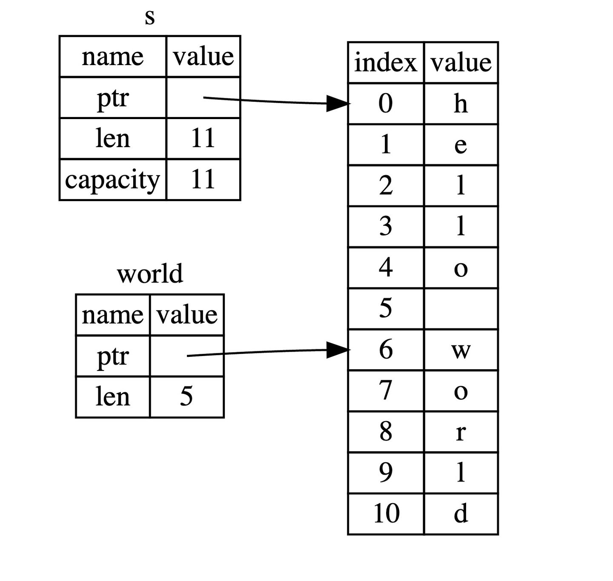

# Content

> In the previous sections, we explored the memory structure of the `String` type. With this foundation, understanding the concept of slices in this section becomes more accessible.
> 

**Slice:**
A **slice** is a reference data structure that allows you to reference a part of the data without copying the entire content. Slices are commonly used with array, string, and other collection types.

**String Slice:**
A **string slice** is a special type of slice designed for handling strings. The type of a string slice is `&str`. It allows specifying a part of the string through indexing or ranges. String slices provide a reference to the string without introducing additional memory overhead. This section discusses slices of dynamically resizable strings allocated in memory.

- **Metaphor**
    
    We can compare a **whole book** to a string; it can contain a vast amount of information, but you might be interested in only a portion, like pages 10-20. Similarly, you can focus on these pages without the need to read the entire book—this is analogous to using a slice.
    
- **Use Case**

### Documentation:

Let's explore the basic syntax of slices and the corresponding memory model.

```rust
// The string is allocated in memory
let s = String::from("hello world");

// "hello" does not reference the entire String s but only a part of it, specified by [0..5].
let hello: &str = &s[0..5];
let world: &str = &s[6..11];

```

Creating a slice requires specifying the range using `[start index..end index]`, representing a data range that includes the start position but excludes the end position, i.e., **half-open interval**. The indexing starts from 0.



### FAQ:

**Q: What should be considered when the string contains Chinese characters when obtaining a string slice?**

A: String slice indexing is based on **bytes**, not **characters**. Since Chinese characters use UTF-8 encoding, a Chinese character may consist of **one or more bytes**. Therefore, the index must correspond to a complete boundary of a Chinese character; otherwise, obtaining that character will fail.

```rust
let chinese_string = "中国人";

// Getting the slice zhong will fail because a Chinese character may consist of "one or more bytes".
// "中" here occupies 3 bytes, so [0..2] does not correspond to the boundary of a complete Chinese character
let zhong = &chinese_string [0..2];

// The correct way to write it is that one Chinese character occupies 3 bytes, that is, the byte range of the Chinese character "中" is 0, 1, 2
let zhong = &chinese_string[0..3];
println!("{}", zhong);
```

# Example

Next we look at several ways to create slices.

```solidity
fn main() {
     let s: String = String::from("hello, hackquest.");

     // Starting from 0, .. represents one or more indexes
     let slice1: &str = &s[0..2];
     //The default also starts from 0
     let slice2: &str = &s[..2];

     let len: usize = s.len();
     // Contains the last byte. Since the index of the last byte is (len-1), the [4..len] method just contains the (len-1)th byte.
     let slice3: &str = &s[4..len];
     //Default to the last byte
     let slice4: &str = &s[4..];

     // Get a slice of the entire string
     let slice5: &str = &s[0..len];
     // Same as above
     let slice6: &str = &s[..];
}
```