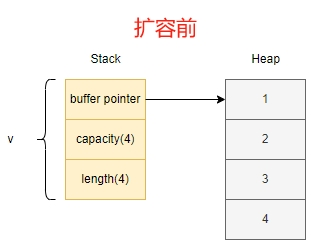
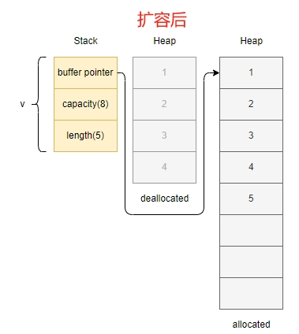

# Content

**Vector (`Vec<T>`):** A flexible data structure in Rust that allows dynamic changes in size at runtime. Its length is mutable, enabling the addition or removal of elements as needed. This flexibility is convenient for handling an unknown quantity of data, such as reading an unknown number of user inputs or dynamically generating datasets.

Different from the `String` type, the dynamic array `Vec<T>` is generic and can store elements of "any type," while `String` is specifically designed for handling UTF-8 encoded textual data. Although dynamic arrays (`Vec`) provide more flexible operations, `String` offers additional string-specific features like concatenation and slicing. The choice between using `Vec` or `String` depends on specific requirements and data types.

- **Metaphor**
    
    Many real-world entities exhibit characteristics similar to dynamic arrays. For example, consider a shopping bag: imagine a bag that can adjust its size at any time. You can add or remove items based on your shopping needs without having to determine the bag's size in advance. Another analogy is a playlist: in a music or video playlist, you can continually add or remove tracks based on preferences without being restricted by the playlist's size. This flexibility is similar to the mutability of dynamic arrays, supporting size adjustments at runtime.
    
- **Use Case**
    
    In Solana transactions, the `instruction` data, representing parameters when calling a program (smart contract), is mutable. Therefore, it is represented using a dynamic array:
    
    ```rust
    // solana_program::instruction::Instruction
    
    pub struct Instruction {
        pub program_id: Pubkey,
        pub accounts: Vec<AccountMeta>,
        // Data passed to the program, a dynamic array of type u8
        pub data: Vec<u8>,
    }
    ```
    

### Documentation

The following code demonstrates five different ways to create Vector:

```solidity
// 1. Explicitly declare the dynamic array type
let v1: Vec<i32> = Vec::new();

// 2. Compiler automatically infers type based on elements; v must be declared as mut to modify.
let mut v2 = Vec::new();
v2.push(1);

// 3. Use the vec! macro to create an array, supporting initialization values at creation
let v3 = vec![1, 2, 3];

// 4. Use [initial value; length] to create an array with a default value of 0 and an initial length of 3
let v4 = vec![0; 3];  // v4 = [0, 0, 0];

// 5. Use the from syntax to create an array
let v5 = Vec::from([0, 0, 0]);
assert_eq!(v4, v5);
```

### FAQ

**Q: What is the memory structure of the dynamic array `Vec` in memory, and how is dynamic resizing achieved?**

```rust
fn main() {
    let mut v: Vec<i32> = vec![1, 2, 3, 4];
    // prints 4; the initial capacity of the array is 4
    println!("v's capacity is {}", v.capacity());
    // prints the memory address
    println!("Address of v's first element: {:p}", &v[0]);

    v.push(5);
    // prints 8; the array is resized, and the capacity becomes 8
    println!("v's capacity is {}", v.capacity());
    // prints the memory address after resizing; notice it's different from the previous address
    println!("Address of v's first element: {:p}", &v[0]);
}
```

Initially, the dynamic array `v` has a capacity of 4, storing values in heap memory. The stack memory contains a pointer to the heap memory address, along with information about the array's capacity and size. When adding a new element (e.g., 5), the array is resized by allocating a new block of memory that is twice the size (in this case, 8). All elements are then copied to the new memory location, and the pointer data is updated. The array size becomes 5, and the capacity becomes 8.





# Example

We show some common operations of Vector (access, modification, insertion, deletion, etc.) in the code below.

```solidity
fn main() {
     let mut v1 = vec![1, 2, 3, 4, 5];

     // Directly access the element at the specified position through [index]
     let third: &i32 = &v1[2];
     println!("The third element is {}", third);

     //Access through the .get() method to prevent the subscript from going out of bounds
     // match belongs to pattern matching, which will be introduced in detail in subsequent chapters.
     match v1.get(2) {
         Some(third) => println!("The third element is {third}"),
         None => println!("The specified element does not exist"),
     }

     //Iterate through and modify elements
     for i in &mut v1 {
         // Here i is a mutable reference to the element in array v. The value is obtained through *i dereference and + 10
         *i += 10
     }
     println!("v1 = {:?}", v1); // v1 = [11, 12, 13, 14, 15]

     let mut v2: Vec<i32> = vec![1, 2];
     assert!(!v2.is_empty()); // Check if v2 is empty
     v2.insert(2, 3); //Insert data at the specified index. The index value cannot be greater than the length of v, v2: [1, 2, 3]
     assert_eq!(v2.remove(1), 2); // Remove the element at the specified position and return, v2: [1, 3]
     assert_eq!(v2.pop(), Some(3)); // Delete and return the element at the end of v, v2: [1]
     v2.clear(); // Clear v2, v2: []
}
```