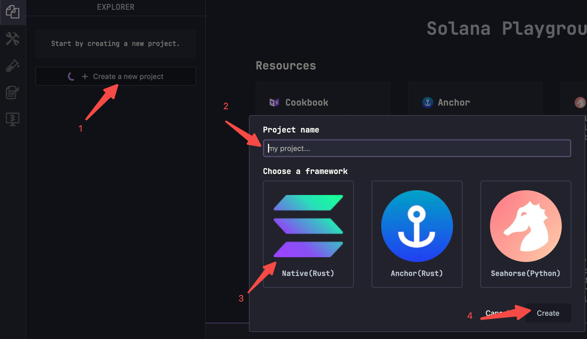
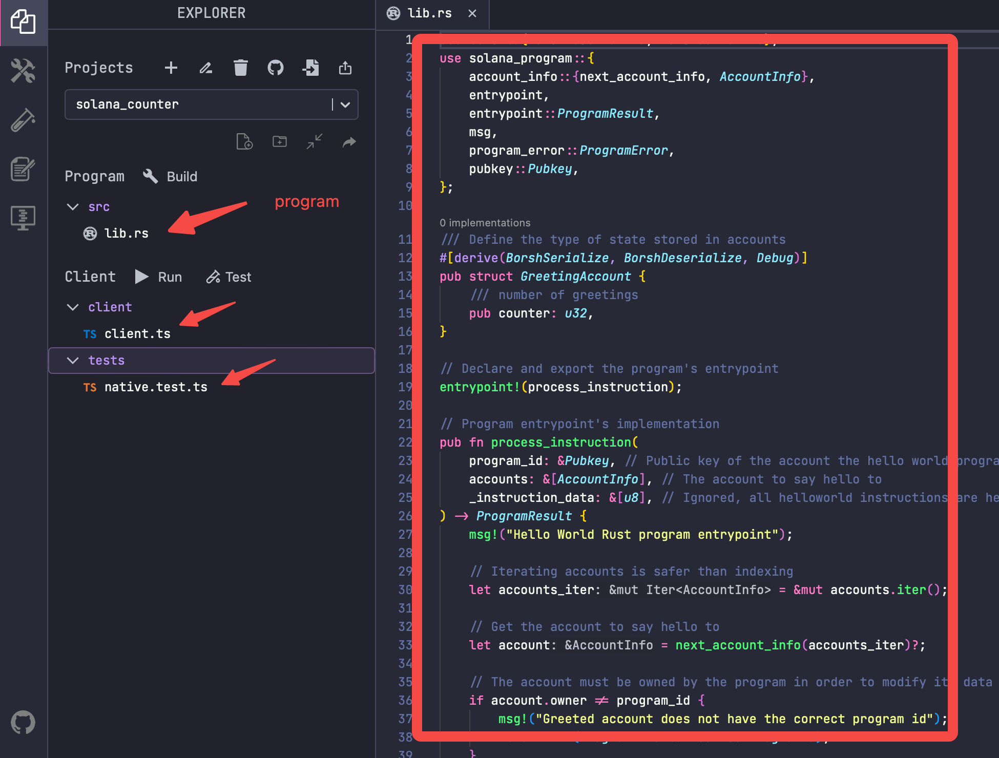
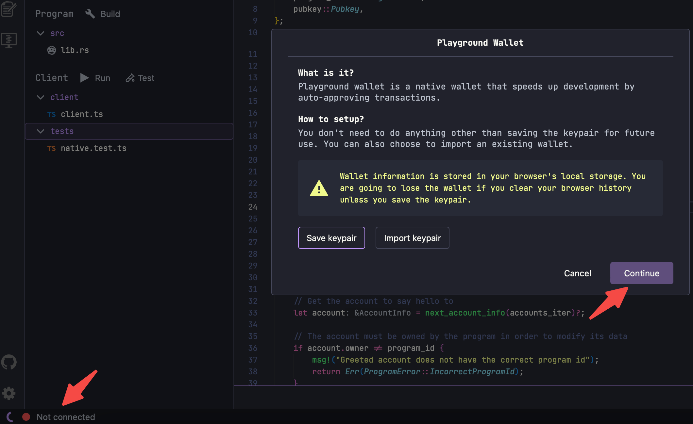
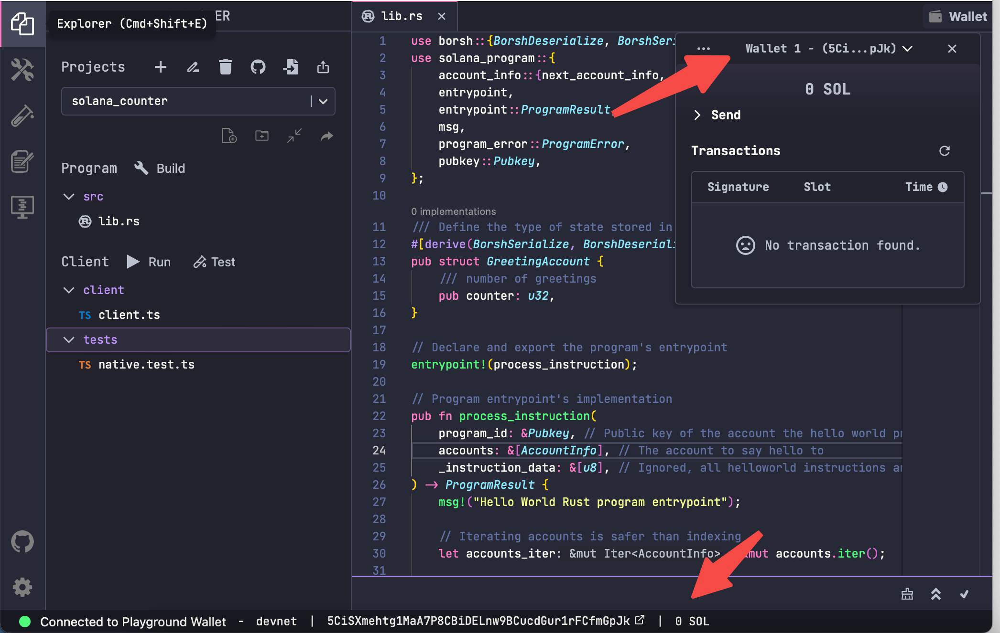
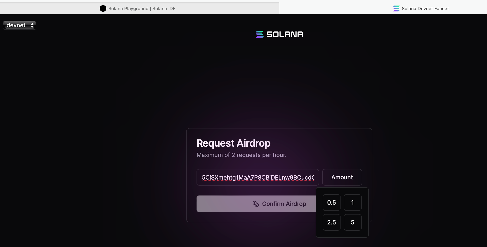
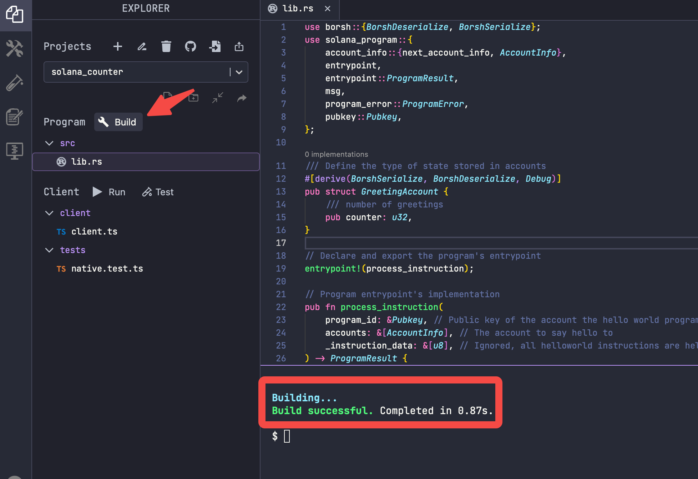
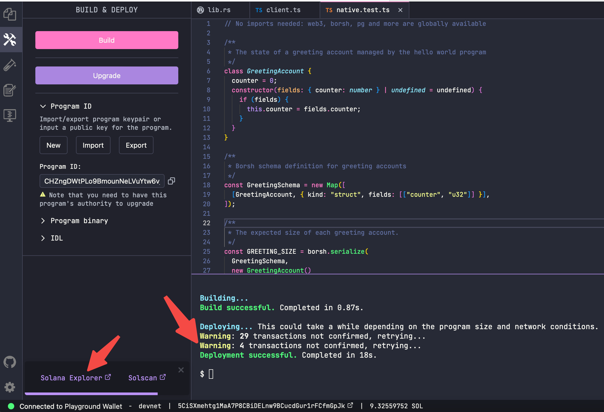
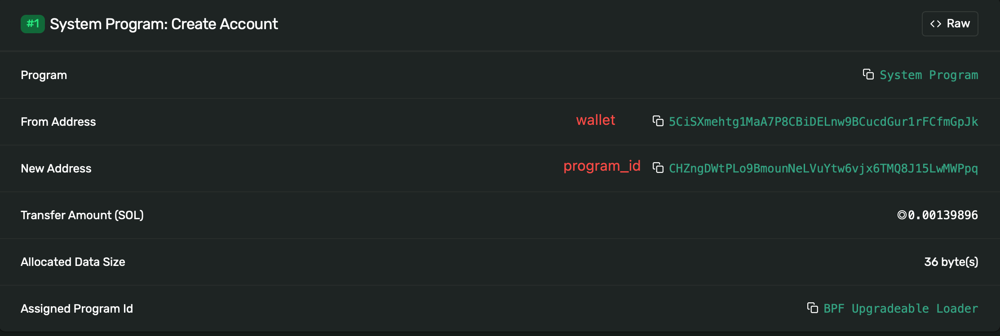
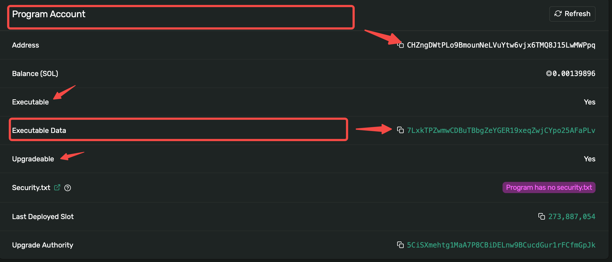

# Content

In this section, let's learn how to interact with a Solana program: compiling and deploying.

We'll be using Solana's [***Playground***](https://beta.solpg.io/), which is an IDE tool that allows you to write and deploy Solana programs directly from your browser.

1. When you open the IDE in your browser, the first icon on the left is the project management menu, the second icon is for compiling and deploying Solana programs, and the bottom-left corner displays network and wallet information.
    
    
    
2. In the project management menu, click on ***Create a new project*** to create a new project named ***solana_counter***. Fill in the project name, choose ***Native (Rust)*** as the framework (we are using Rust to write a native Solana program, and we'll introduce the Anchor framework in later chapters), and then create the example project.
    
    
    
3. Once created, the IDE automatically provides a sample project and corresponding test script.  ***You need to paste the program code of the Example on the right*** (it is slightly different from the default sample project, ******please pay attention to the difference between the two).
    
    
    
4. Click on the link to the Solana network in the bottom-left corner. If you haven't created a wallet before, the Playground will automatically create one for you. Alternatively, you can choose to import a private key to generate a specified wallet.
    
    
    
5. The bottom of the interface and the top-right corner will show the connected network and wallet balance information. If it's a new wallet, the balance will be 0 at this point.
    
    
    
6. Claim test coins from the ***Solana faucet [here](https://faucet.solana.com/).*** You can receive up to 10 SOL per hour.
    
    
    
7. When everything is ready, click the **Build** button to compile the program source code in `lib.rs`. Compilation information will be displayed below. If there are errors, troubleshoot through the compilation logs. After successful compilation, we can proceed with deploying the program.
    
    
    
8. After compilation, we can deploy (and later upgrade) the program using the **Deploy** button in the second menu on the left. Details and results of the deployment will be displayed below. The program account's address is `CHZngDWtPLo9BmounNeLVuYtw6vjx6TMQ8J15LwMWPpq`.
    
    
    
9. After successful deployment, you can view the [transaction information](https://explorer.solana.com/tx/n4rQU85FmLjB82RAkRvRwj9jYYSseUYfvRi4jY6ZpxuoNGd8qFCiV4UsDbyKVviY5GWcBm7hwNVzMvr5JhvYaux?cluster=devnet) on the Solana blockchain explorer. The `5CiS...` is your wallet's public key, and `CHZn…` is the program account. It has the `executable` attribute and is `updateable`. The account `7Lxk…` under this program ID stores the binary file of the program (note: the binary file is stored in the sub-account below, not directly in the program account).
    
    
    
    Here, the relationship between the program account and sub-accounts (storing the program binary file) is illustrated.
    
    
    

In the next section, we'll demonstrate how to invoke the program.

# Example

Here is a counter program implemented in Solana.

```rust
use borsh::{BorshDeserialize, BorshSerialize};
use solana_program::{
     account_info::{next_account_info, AccountInfo},
     entrypoint,
     entrypoint::ProgramResult,
     msg,
     program_error::ProgramError,
     pubkey::Pubkey,
};

/// Define the structure of the data account
#[derive(BorshSerialize, BorshDeserialize, Debug)]
pub struct CounterAccount {
     pub count: u32,
}

//Define program entry point function
entrypoint!(process_instruction);

pub fn process_instruction(
		 //Program ID, that is, program address
     program_id: &Pubkey,
		 //The set of accounts involved in this command
     accounts: &[AccountInfo],
		 // command data
     _instruction_data: &[u8],
) -> ProgramResult {
     msg!("Hello World Rust program entrypoint");

     //Account iterator
     let accounts_iter = &mut accounts.iter();

     // Get the caller account
     let account = next_account_info(accounts_iter)?;

     //Verify caller identity
     if account.owner != program_id {
         msg!("Counter account does not have the correct program id");
         return Err(ProgramError::IncorrectProgramId);
     }

     // Read and write new values
     let mut counter = CounterAccount::try_from_slice(&account.data.borrow())?;
     counter.count += 1;
     counter.serialize(&mut *account.data.borrow_mut())?;

     Ok(())
}
```