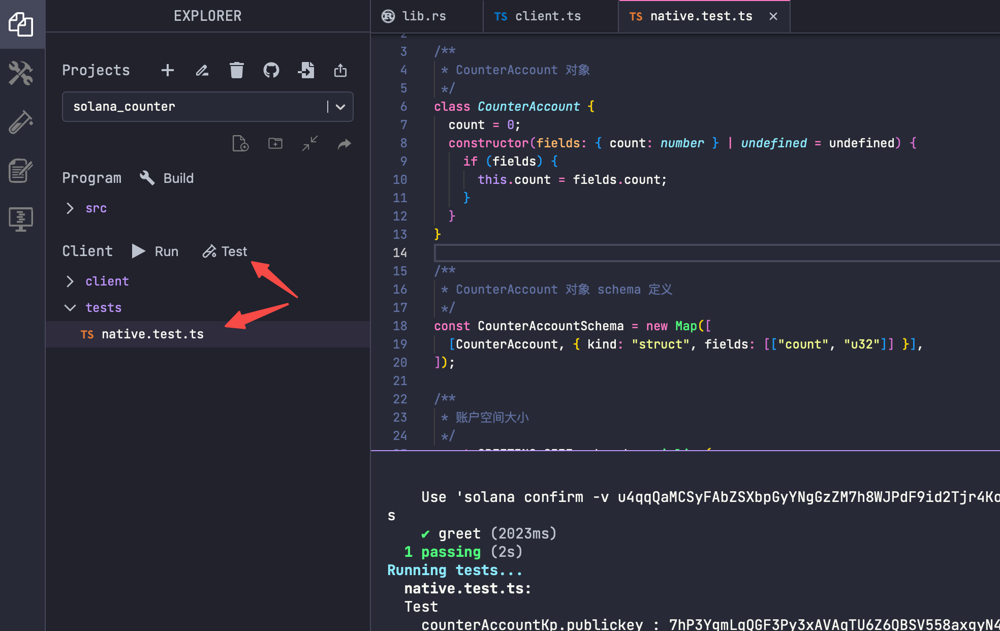

# Content

In this section, let's learn how to invoke the Solana program using a test script.

Under the `Client` → `tests` menu on the left, fill in our TypeScript test script (the script is in the Example on the right), and click the `Test` button to execute the test.



In the test script, we mainly do the following:

### Create a Counter Object

Here, a `CounterAccount` class is defined, and an object instance is initialized using the constructor. A `CounterAccountSchema` object is created, defining the serialization rules for the `CounterAccount` class. Next, the number of bytes required to serialize a `CounterAccount` object (`GREETING_SIZE`) is calculated, and this value will be used later to determine the account space when creating an account.

### Create a Data Account

```tsx
// Create keypair
const counterAccountKp = new web3.Keypair();
console.log(`counterAccountKp.publickey : ${counterAccountKp.publicKey}`)
const lamports = await pg.connection.getMinimumBalanceForRentExemption(
    GREETING_SIZE
);

// Create the instruction to generate the corresponding data account
const createGreetingAccountIx = web3.SystemProgram.createAccount({
    fromPubkey: pg.wallet.publicKey,
    lamports,
    newAccountPubkey: counterAccountKp.publicKey,
    programId: pg.PROGRAM_ID,
    space: GREETING_SIZE,
});
```

- A new Solana Keypair (`counterAccountKp`) is created to store the state of the counter.
- The minimum lamports required to create the corresponding account on the chain, i.e., the minimum deposit `rent` to store the account on the Solana, is obtained using the Solana API.
- The `createGreetingAccountIx` instruction is constructed to create the specified `counterAccountKp.publicKey` account on the chain, specifying the size of the account.

### Call the Solana Program

Next, we create the following instruction to call the previously deployed Solana program, passing in the corresponding data account `counterAccountKp.publicKey` to store the counter state. The counter program will increment based on the data in that account, so the counter changes from the initial value of 0 to 1.

```tsx
const greetIx = new web3.TransactionInstruction({
    keys: [
        {
            pubkey: counterAccountKp.publicKey,
            isSigner: false,
            isWritable: true,
        },
    ],
    programId: pg.PROGRAM_ID,
});

```

### View the Program Execution Result

Call the `getAccountInfo` function to get information about the specified address's data. By deserializing, we can convert the binary data into our counter object, and at this point, its value is 1.

```tsx
// Get information about the specified data account
const counterAccountOnSolana = await pg.connection.getAccountInfo(
    counterAccountKp.publicKey
);

// Deserialize
const deserializedAccountData = borsh.deserialize(
    CounterAccountSchema,
    CounterAccount,
    counterAccountOnSolana.data
);

// Check if the counter has been incremented
assert.equal(deserializedAccountData.count, 1);
```

# Example

The following is the complete content of the `native.test.ts` test script, which needs to be placed in the `Client→tests` folder.

```jsx
// No imports needed: web3, borsh, pg and more are globally available

/**
  * CounterAccount object
  */
class CounterAccount {
   count = 0;
   constructor(fields: { count: number } | undefined = undefined) {
     if (fields) {
       this.count = fields.count;
     }
   }
}

/**
  * CounterAccount object schema definition
  */
const CounterAccountSchema = new Map([
   [CounterAccount, { kind: "struct", fields: [["count", "u32"]] }],
]);

/**
  *Account space size
  */
const GREETING_SIZE = borsh.serialize(
   CounterAccountSchema,
   new CounterAccount()
).length;

describe("Test", () => {
   it("greet", async () => {
     //Create keypair
     const counterAccountKp = new web3.Keypair();
     console.log(`counterAccountKp.publickey : ${counterAccountKp.publicKey}`)
     const lamports = await pg.connection.getMinimumBalanceForRentExemption(
       GREETING_SIZE
     );

     // Create instructions to generate corresponding data accounts
     const createGreetingAccountIx = web3.SystemProgram.createAccount({
       fromPubkey: pg.wallet.publicKey,
       lamports,
       newAccountPubkey: counterAccountKp.publicKey,
       programId: pg.PROGRAM_ID,
       space: GREETING_SIZE,
     });

     // Call the program and the counter accumulates
     const greetIx = new web3.TransactionInstruction({
       keys: [
         {
           pubkey: counterAccountKp.publicKey,
           isSigner: false,
           isWritable: true,
         },
       ],
       programId: pg.PROGRAM_ID,
     });

     //Create a transaction, including the above 2 instructions
     const tx = new web3.Transaction();
     tx.add(createGreetingAccountIx, greetIx);

     //Initiate a transaction and obtain the transaction hash
     const txHash = await web3.sendAndConfirmTransaction(pg.connection, tx, [
       pg.wallet.keypair,
       counterAccountKp,
     ]);
     console.log(`Use 'solana confirm -v ${txHash}' to see the logs`);

     // Get the information of the specified data account
     const counterAccountOnSolana = await pg.connection.getAccountInfo(
       counterAccountKp.publicKey
     );

     //Deserialize
     const deserializedAccountData = borsh.deserialize(
       CounterAccountSchema,
       CounterAccount,
       counterAccountOnSolana.data
     );

     // Determine whether the current counter is accumulating
     assert.equal(deserializedAccountData.count, 1);
   });
});
```