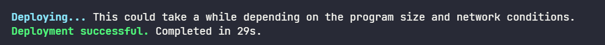

# Content/Interaction

After finishing the coding logic, the next step is to deploy the program to the *Solana network*. In this section, we will use the [playground](https://beta.solpg.io/) tool provided by Solana. This platform makes our deployment and testing process more convenient and efficient.

- **Step 1**
    
    First, we create a Solana project using the Anchor.
    
    
    
    After creating the project, we generate three files.
    
    
    
    - **lib.rs**: Here we define the core logic of the Rust project.
    - **client.ts**: Here we define the *logic for interacting with the Solana program*. It usually includes sending transactions, retrieving data from the blockchain, and handling user interactions.
    - **anchor.test.ts**: As the name suggests, this file is related to the Anchor and is used for writing and running *tests* for the Solana program.
- **Step 2**
    
    Second, we need to create a *Playground wallet* and claim some SOL for subsequent operations (deploying programs on Solana consumes resources).
    
    1. Click to create a new key pair to generate a wallet.
        
        
        
    2. Click on the *wallet* in the top right corner to see our newly generated wallet (currently *0* SOL). 
        
        
        
    3. Claim SOL, we have several methods:
        - Through the [faucet](https://faucet.solana.com/).
            
            
            
            
            
        - Enter **solana airdrop 5** in the terminal.
            
            
            
        - Ask your Solana developer friend to transfer some to you (here we asked the kind friend Novar).
        
        After claiming, we have 5 SOL! This is enough for a deployment test operation.
        
        
        
- **Step 3**
    
    Third, prepare to deploy the program.
    
    1. Copy our ***Counter*** code into the ***lib.rs*** file.
        
        
        
    2. Copy the example code of ***client.ts*** into the corresponding file.
        
        
        
    3. Switch to the second button on the left toolbar and click **build**.
        
        
        
    4. Click **deploy**, and the terminal shows “*Deployment successful.*” indicating successful deployment (this will consume about 2-3 SOL).
        
        
        
        
        
- **Step 4**
    
    Fourth, run the ***client.ts***.
    
    1. **Run** Switch to the first button on the left and click **Run**.
        
        
        
    2. The terminal outputs the initialized value and the value after the count increase.
        
        

Congratulations 🎉, you have completed this course!

# Example/Code

**Counter code**

```rust
use anchor_lang::prelude::*;
use std::ops::DerefMut;

declare_id!("4rYU4LZNaM1smqPx3omxBrKkRdUEMQvfFoJ2F3nNYVv5");

#[program]
pub mod counter {
    use super::*;

    pub fn initialize(ctx: Context<Initialize>) -> Result<()> {
        let counter = ctx.accounts.counter.deref_mut();
        let bump = ctx.bumps.counter;

        *counter = Counter {
            authority: *ctx.accounts.authority.key,
            count: 0,
            bump,
        };

        Ok(())
    }

    pub fn increment(ctx: Context<Increment>) -> Result<()> {
        require_keys_eq!(
            ctx.accounts.authority.key(),
            ctx.accounts.counter.authority,
            ErrorCode::Unauthorized
        );

        ctx.accounts.counter.count += 1;
        Ok(())
    }
}

#[derive(Accounts)]
pub struct Initialize<'info> {
    #[account(
        init,
        payer = authority,
        space = Counter::SIZE,
        seeds = [b"counter"],
        bump
    )]
    counter: Account<'info, Counter>,
    #[account(mut)]
    authority: Signer<'info>,
    system_program: Program<'info, System>,
}

#[derive(Accounts)]
pub struct Increment<'info> {
    #[account(
        mut,
        seeds = [b"counter"],
        bump = counter.bump
    )]
    counter: Account<'info, Counter>,
    authority: Signer<'info>,
}

#[account]
pub struct Counter {
    pub authority: Pubkey,
    pub count: u64,
    pub bump: u8,
}

impl Counter {
    pub const SIZE: usize = 8 + 32 + 8 + 1;
}

#[error_code]
pub enum ErrorCode {
    #[msg("You are not authorized to perform this action.")]
    Unauthorized,
}
```

**client code**

```tsx
const wallet = pg.wallet;
const program = pg.program;
const counterSeed = Buffer.from("counter");

const counterPubkey = await web3.PublicKey.findProgramAddressSync(
  [counterSeed],
  pg.PROGRAM_ID
);

const initializeTx = await pg.program.methods
  .initialize()
  .accounts({
    counter: counterPubkey[0],
    authority: pg.wallet.publicKey,
    systemProgram: web3.SystemProgram.programId,
  })
  .rpc();

let counterAccount = await program.account.counter.fetch(counterPubkey[0]);
console.log("account after initializing ==> ", Number(counterAccount.count));

const incrementTx = await pg.program.methods
  .increment()
  .accounts({
    counter: counterPubkey[0],
    authority: pg.wallet.publicKey,
  })
  .rpc();

counterAccount = await program.account.counter.fetch(counterPubkey[0]);
console.log("account after increasing ==>", Number(counterAccount.count));
```