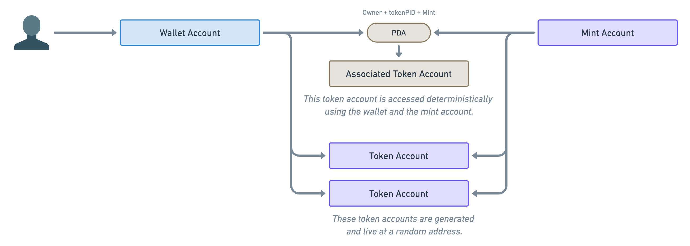

# Content/**Metadata Account Introduction**

In our last lesson, we learned about the basic concept of NFTs on Solana: they are SPL Tokens with a fixed supply of 1. In this lesson, we'll delve into how to add additional data to an NFT, such as the creator's information, name, and image URL.

**Metaplex**

> Unlike Ethereum, where smart contracts contain both the logic code and the data required by that contract, Solana operates differently. On Solana, programs (equivalent to smart contracts) interact with data accounts stored outside of the programs. This separation allows for data to be unrestricted by the program size, enabling the development of more scalable features.
> 

Building on this, the **Metaplex** organization has launched a suite of tools and programs to facilitate the creation, release, and trading of Solana NFTs, simplifying the management of tasks including the creation and minting of NFT collections.

> The Metaplex protocol primarily consists of three programs: **Token Metadata**, **The Candy Machine**, and **Auction House**.
> 
1. **Token Metadata** establishes the standard for defining NFT metadata.
2. **The Candy Machine** manages the distribution of NFTs.
3. **Auction House** oversees the auction and sale of NFTs.

In this course, we will focus on the **Token Metadata** program, which adds additional data to SPL Tokens. This metadata encompasses various details about the token creator, including the creator's information, name, transaction tax, URL, upgrade authority, and more.

**Metadata Account**

Considering SPL Tokens, if we wish to send someone Kitty tokens but they don't have an account for Kitty tokens, what should we do? Should we create a new Kitty token account for them before sending the tokens?

From our previous lessons on Solana basics, we know that the solution is a **Program Derived Address (PDA)**, which uses a special algorithm to derive a new public key from other public keys. Given a **wallet account** and a **mint account**, we can definitively locate the associated token account, known as an **Associated Token Account (ATA)**.



Metaplex protocol's **Metadata Account** is an extension of this concept, defining an account to store NFT metadata information, referred to as the "**Metadata Account**". Its address is a unique PDA derived from the **Metadata NFT** management program and the SPL Token's **Mint Account**.


Therefore, knowing the SPL Token allows us to determine its corresponding Metadata.

With this understanding, we know how to add additional information to an NFT, such as Name, Symbol, and Creators.

Having learned how to add metadata to our NFTs, we're not done yet. To manage the issuance of NFTs, **Metaplex** introduces the **Master Edition Account**.

Stay tuned for more learning! 🚀🚀🚀

**Syntax** 

use

- hint
    
    ```rust
    use anchor_spl::token;
    ```
    