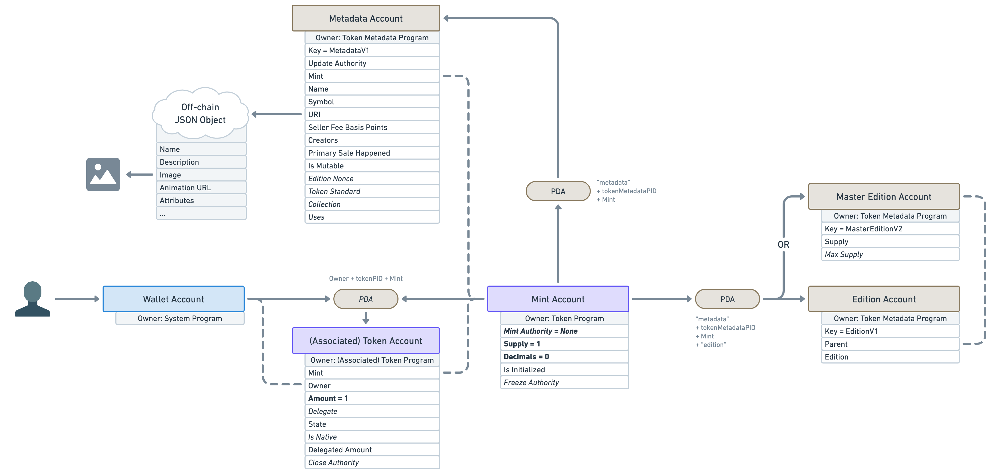

# Content/ ****Master Edition Account

In the previous lesson, we learned about the **Metadata Account** of **Metaplex**, which allows us to associate NFT metadata with SPL Tokens. In this lesson, we will delve into another account in **Metaplex** called the **Master Edition Account**, which is used to manage the minting of NFTs.

**Master Edition Account**

As we've learned before, NFTs on Solana are essentially regular SPL Tokens with a fixed supply of 1. But what if an artist wants to release 100 copies of their artwork, each with a unique version number, essentially creating a limited edition 1/1 NFT? How can we achieve this?

To address this, **Metaplex** introduces the **Master Edition Account** to manage the minting of NFTs:

Similar to the initial **Mint Account**, the **Master Edition Account** is derived using the PDA method. Thus, if we know the SPL Token, we can determine its corresponding **Master Edition Account**.

It has two key attributes:

- **Supply**: The current supply, indicating the number of times the original NFT has been minted or duplicated.
- **Max Supply**: The maximum supply. Once the supply reaches the maximum, no more NFTs can be minted in this manner. However, note that if the **Max Supply** attribute of the **Master Edition** is set to null, it means that this NFT can be minted infinitely.

With this knowledge, we now have a basic understanding of Solana NFTs. Next, we will move on to the practical coding section where we will apply our acquired knowledge step by step to complete our NFT project. 🚀🚀🚀
