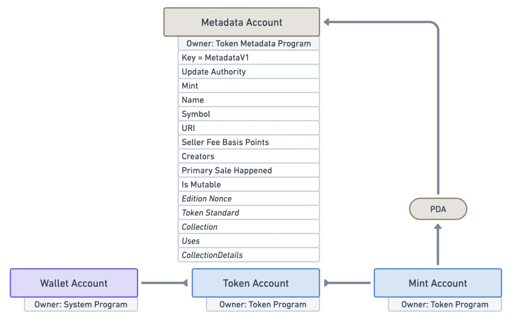

# Content/Preface

**Reviewing the Basics of Solana NFTs:**

In the world of Solana, there doesn't seem to be a universally recognized NFT protocol standard similar to ERC721. However, Metaplex is one of the most widely adopted NFT implementation schemes to date, originating from an internal initiative at Solana Labs. Metaplex can essentially be viewed as an NFT toolkit platform that has established a series of standards, including a range of smart contracts, tools, and even UI components. Through these tools, it enables everyone to quickly launch their NFTs.

We'll delve into:

1. Defining metadata properties related to NFTs.
2. Creating metadata accounts.

Are you ready? Let's continue our exciting journey into the world of Solana NFT development! 🚀✨✨